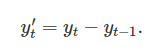
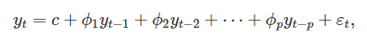
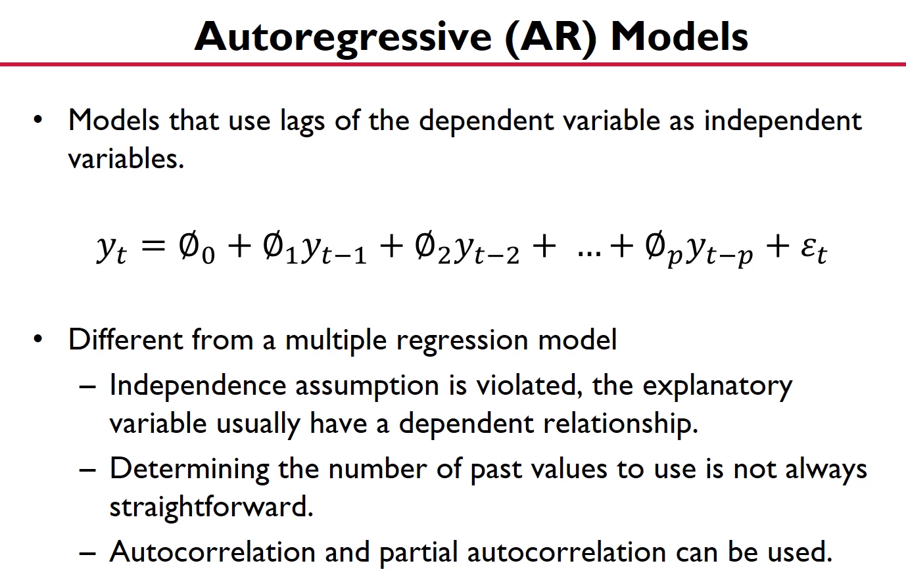
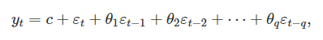
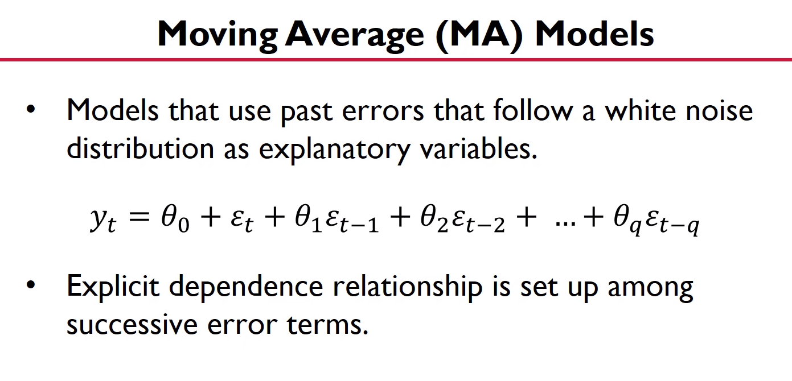
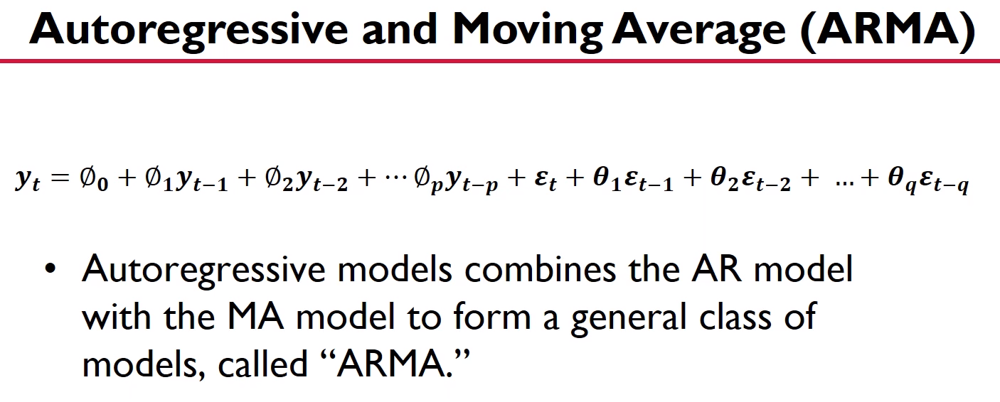
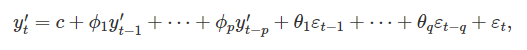
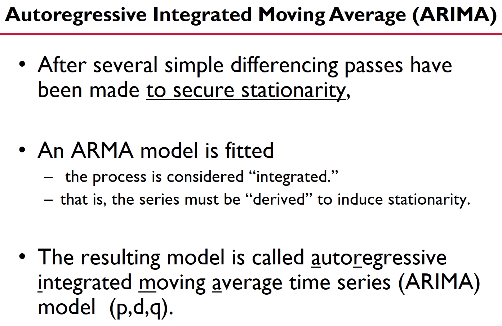
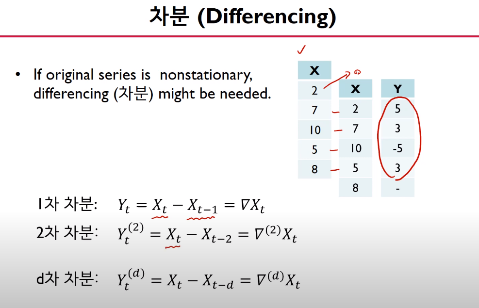
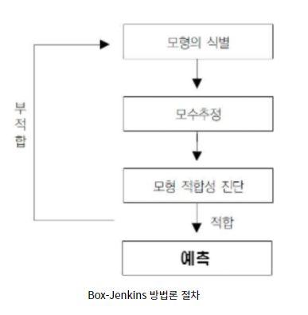

# ARIMA

- 정상 프로세스(Stationary Process)
  - 시간에 관계없이 평균과 분산이 일정한  시계열 데이터
- 정상성 확인
  - ACF(Autocorrelation Function)의 패턴을 이용
    - 현재 시점 데이터와 한 시점 전의 데이터를 비교
    - 특정한 패턴 없이 랜덤하게 나타나는 경우 정상성을 가지고 있다 판단가능
  - PACF(Partial Autocorrelation Function) 이용

- Nonstationary Process(비정상성 프로세스)

- 비정상성 확인
  - ACF 이용
    - 그래프가 천천히 줄어든다.
  - PACF 이용

- 차분(differencing)
  - 정상성을 나타내지 않는 시계열을 정상성을 나타내도록 만드는 한가지 방법
  - 연이는 관측값들의 차이를 계산하는 것
  - 

### Autoregressive(AR) Models

- 자기회귀모델
  - 변수의 과거 값의 선형 조합을 이용하여 관심 있는 변수를 예측
  - 차수 P의 자기회귀 모델(autoregressive modles)은 다음과 같이 쓸 수 있다.
  - 

---

### Moving Average(MA) Models

- 이동 평균 모델
  - 회귀에서 목표 예상 변수의 과거 값을 이용하는 대신에 이동 평균 모델은 회귀처럼 보이는 모델에서 과거 예측 오차를 이용한다.
  - t시점의 데이터를 t시점의 에러와 그전시점의 에러들로 표현하겠다.
  - 연속적인 에러 텀으로 표현
  - 

### Autoregressive and Moving Average(ARMA)

- ARMA 모델
  - AR 과 MA 합친것 

### Autoregressive Integrated and Moving Average(ARIMA)

- 이동 평균을 누적한 자기회귀
  - 차분을 구하는 것을 차기회귀와 이동 평균 모델과 결합하면, 비-계절성(non-seasonal) ARIMA 모델을 얻는다.
  - 
  - ARIMA(p,d,q) 모델
    - p : 자기 회귀 부분의 차수(AR)
    - d : 1차 차분이 포함된 정도(I)
    - q : 이동 평균 부분의 차수(MA)
    - auto.arima() 함수를 통해 적절한 p,d,q 를 구할 수 있다.
  - 규칙적으로 증가하거나 감소하는 데이터는 1차 차분으로 충분하고 좀더 복잡한 데이터는 2차 이상의 차분이 필요하지만 대부분 2차차분으로 충분하다. (3차 이상이 필요한 데이터는 ARIMA모델에 적합하지 않다.)

### Box-Jenkins 방법론 

> 확률적인 시계열 모형을 주어진 데이터에 적합시키면 이 모형의 적합성 여부에 대해 판단하는 일종의 절차가 존재한다. 이 중 대표적인 방법이 Box-Jenkins 방법론이다.

1. 모형 식별
   - 주어진 데이터의 ACF(자기상관함수), PACF(편자기상관함수)를 관찰하고 해당 데이터에 어떤 모형을 적합시키면 좋을지 여러가지 모형의 후보들을 만들어 본다. 
     - ACF : 같은 변수라도 시차를 가지고 스스로와 얼마나 비슷한지 나타내는 함수
     - PACF : 임의의 시차 k에 대하여 Zt 와 Zt+k 사이의 값들(Zt+1, Zt+2 , ... , Zt+k-1)의 상호의존성을 제거한 후의 Zt와 Zt+k만의 자기상관함수
2. 모수추정
   - 1번에서 도출된 여러가지 모형의 최적의 모수(Parameter)값을 추정(예를 들어, AR과 MA의 차수, mean값 등등..)한다. 이 때, 최소제곱법, 최대우도법을 사용한다.
3. 모형 적합성 진단
   - 여러가지 모형들 중 어떤 모형이 적합한지 각 모형의 잔차 그래프를 살펴보면서 검정하고 최종 적합 모형을 선정한다.
4. 미래값 예측
   - 3번 단계에서 최종 선정한 모형을 이용해 주어진 데이터의 미래값을 예측한다.

https://techblog-history-younghunjo1.tistory.com/96

https://otexts.com/fppkr/arima.html

https://www.youtube.com/watch?v=P_3808Xv76Q&list=PLpIPLT0Pf7IqSuMx237SHRdLd5ZA4AQwd&index=10

