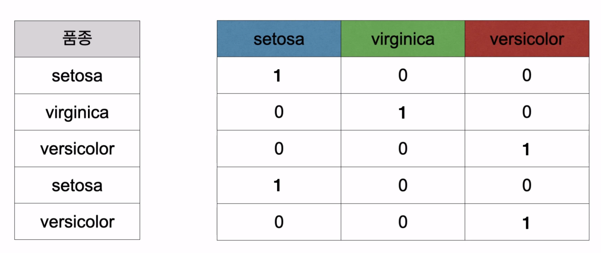
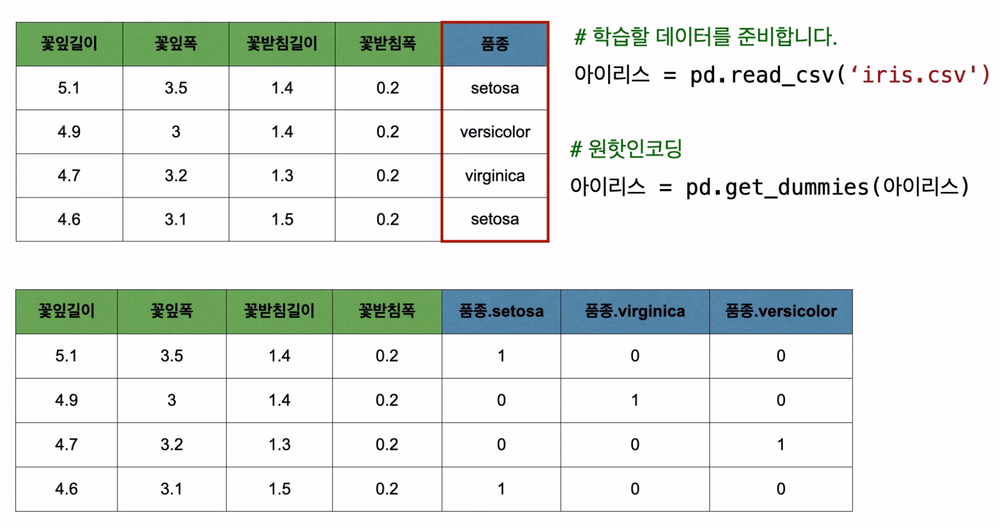

# Tensorflow

---

### 기온에 따른 레모네이드 판매량 예측

- 독립변수 하나와 종속변수 하나로 만든 모델

```python
import tensorflow as tf
import pandas as pd
 
###########################
# 데이터를 준비합니다.
파일경로 = 'https://raw.githubusercontent.com/blackdew/tensorflow1/master/csv/lemonade.csv'
레모네이드 = pd.read_csv(파일경로)
레모네이드.head()
# 종속변수, 독립변수
독립 = 레모네이드[['온도']]
종속 = 레모네이드[['판매량']]
print(독립.shape, 종속.shape)
 
###########################
# 모델을 만듭니다.
# 우리가 사용할 독립변수 칼럼이 '온도' 한개 이기때문에 shape=[1]
X = tf.keras.layers.Input(shape=[1])
# 우리가 예측할 종속변수 칼럼이 '판매량' 한개 이기때문에 Dense(1)
Y = tf.keras.layers.Dense(1)(X)
model = tf.keras.models.Model(X, Y)
model.compile(loss='mse')
 
###########################
# 모델을 학습시킵니다. 
# 전체 데이터를 1000번 반복학습(epochs), 학습진행상황 출력을 끈다 (verbose=0)
model.fit(독립, 종속, epochs=10000, verbose=0)
model.fit(독립, 종속, epochs=10)
 
###########################
# 모델을 이용합니다. 
print(model.predict(독립))
print(model.predict([[15]]))
```


- loss

  > 독립 변수와 종속변수를 가지고 모델을 만든다. 이때 만들어진 모델과 주어진 독립변수들로 예측을 해서 값을 도출하게 되는데 이 값과 실제 종속변수의 값을 비교한다
  >
  > loss = (예측 - 결과) ** 2 
  >
  > loss값이 낮을 수록 정확한 값 예측이 가능하다.
  >
  > - 회귀에 사용하는 loss = mse
  > - 분류에 사용 하는 loss = crossentropy

---

### 집값 예측

- 독립변수 여러개와 종속 변수 하나로 만든 모델

```python
import tensorflow as tf
import pandas as pd
 
###########################
# 1.과거의 데이터를 준비합니다.
파일경로 = 'https://raw.githubusercontent.com/blackdew/tensorflow1/master/csv/boston.csv'
보스턴 = pd.read_csv(파일경로)
print(보스턴.columns)
보스턴.head()
 
# 독립변수, 종속변수 분리 
독립 = 보스턴[['crim', 'zn', 'indus', 'chas', 'nox', 'rm', 'age', 'dis', 'rad', 'tax',
            'ptratio', 'b', 'lstat']]
종속 = 보스턴[['medv']]
print(독립.shape, 종속.shape)
 
###########################
# 2. 모델의 구조를 만듭니다
X = tf.keras.layers.Input(shape=[13])
# 히든레이어 활성화
H = tf.keras.layers.Dense(10, activation='swish')(X)
Y = tf.keras.layers.Dense(1)(H)
model = tf.keras.models.Model(X, Y)
model.compile(loss='mse')

# 모델 구조 확인
model.summary()
 
###########################
# 3.데이터로 모델을 학습(FIT)합니다.
model.fit(독립, 종속, epochs=1000, verbose=0)
model.fit(독립, 종속, epochs=10)
 
###########################
# 4. 모델을 이용합니다
print(model.predict(독립[5:10]))
# 종속변수 확인
print(종속[5:10])
 
###########################
# 모델의 수식 확인
print(model.get_weights())
```

---

### 아이리스 품종 분류

- 분류 방법으로 만든 모델

```python
import tensorflow as tf
import pandas as pd
 
###########################
# 1.과거의 데이터를 준비합니다.
파일경로 = 'https://raw.githubusercontent.com/blackdew/tensorflow1/master/csv/iris.csv'
아이리스 = pd.read_csv(파일경로)
아이리스.head()
 
# 원핫인코딩
# 범주형 데이터만 골라서 원핫 인코딩 해준다.
아이리스 = pd.get_dummies(아이리스)
아이리스.head()
 
# 종속변수, 독립변수
독립 = 아이리스[['꽃잎길이', '꽃잎폭', '꽃받침길이', '꽃받침폭']]
종속 = 아이리스[['품종_setosa', '품종_versicolor', '품종_virginica']]
print(독립.shape, 종속.shape)
 
###########################
# 2. 모델의 구조를 만듭니다
X = tf.keras.layers.Input(shape=[4])

H = tf.keras.layers.Dense(8, activation="swish")(X)
H = tf.keras.layers.Dense(8, activation="swish")(H)
H = tf.keras.layers.Dense(8, activation="swish")(H)
# activation=softmax : 비율을 예측하기 위해
Y = tf.keras.layers.Dense(3, activation='softmax')(H)

model = tf.keras.models.Model(X, Y)
# 분류에 사용하는 loss
# metrics='accuracy' 사람이 보기 편하게 정확도 예측
model.compile(loss='categorical_crossentropy',
              metrics='accuracy')
 
# 모델 구조 확인
model.summary()

###########################
# 3.데이터로 모델을 학습(FIT)합니다.
model.fit(독립, 종속, epochs=1000, verbose=0)
model.fit(독립, 종속, epochs=10)
 
###########################
# 4. 모델을 이용합니다
# 맨 처음 데이터 5개
print(model.predict(독립[:5]))
print(종속[:5])
 
# 맨 마지막 데이터 5개
print(model.predict(독립[-5:]))
print(종속[-5:])
 
###########################
# weights & bias 출력
print(model.get_weights())
```

> 종속 변수가 숫자가 아닌 범주형 데이터이다. 이럴 경우 이 범주형 데이터를 숫자의 형태로 바꾸어 주어야 하는데 이 방법을 `원 핫 인코딩(onehot-encoding)` 이라고 한다. 모든 범주형 변수를 원핫인코딩 해주어야 한다.






```python
Y = tf.keras.layers.Dense(3, activation='softmax')(X)
```

- sigmoid
  - 수학적 정의에서 Sigmoid 함수는 모든 범위의 실수를 취하고 0에서 1 사이의 출력 값을 반환한다. 
- softmax
  -  'n'개의 다른 이벤트에 대해 이벤트의 확률 분포를 계산한다. 일반적으로,이 함수는 가능한 모든 대상 클래스에 대해 각 대상 클래스의 확률을 계산한다.
  - softmax 함수가 다중 분류 모델에 사용되면 각 클래스의 확률을 반환하며 대상 클래스는 높은 확률을 갖는다.


