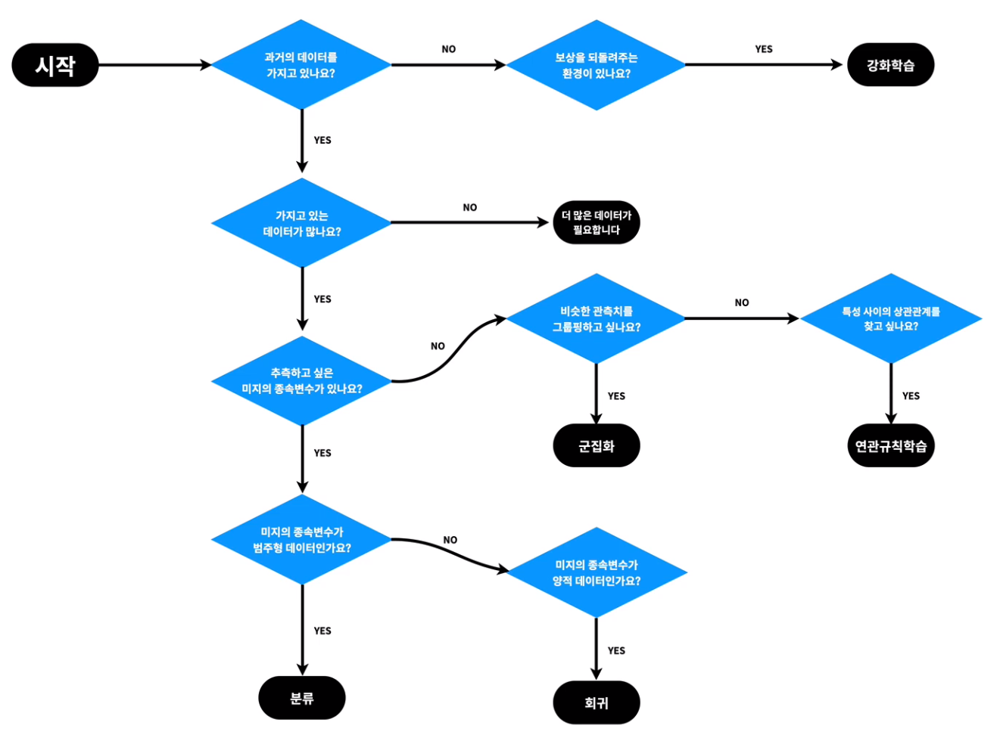
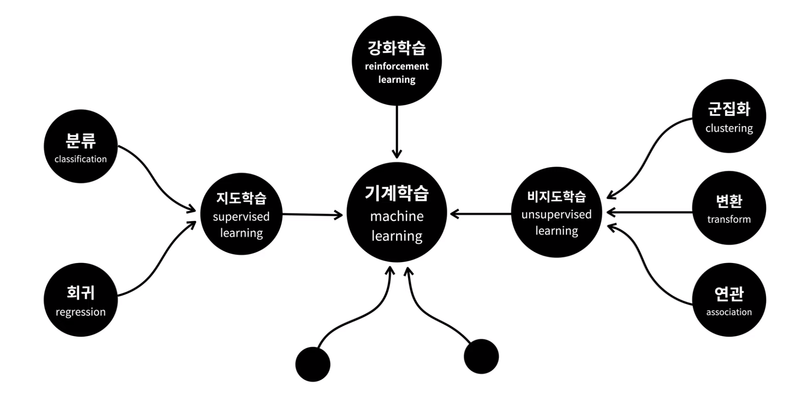

# Machine Learning


### Model

- **`Model` 이란?** s
  - 하나의 커다란 함수 
  - 문제를 바라보는 관점
  - 쉽게 말해 가정이라고 할 수 있다. `데이터가 이런 패턴을 가지지 않을까?` 라는 가정을 머신러닝에서는 모델이라고 한다.
  - 특정 유형의 패턴을 인식하도록 학습된 파일이다. 데이터 세트에 대해 모델을 학습하여 해당 데이터를 추론하고 학습하는데 사용할 수 있는 알고기즘을 제공한다.
  - 모델정하기 -> 모델 수식화 하기 -> 모델 학습하기 -> 모델 평가하기

- **좋은 모델이란?**
  - 데이터의 패턴을 잘 학습한 모델
  - 어떤 모델이 더 좋은 모델인지를 평가하는 것을 돕기위해 모델 평가이론이 등장
    - 편향-분산 트레이드오프 ( 모델의 복잡도와 표현력에 대한 균형을 다룸)
    - 정규화 ( 군형을 자동으로 학습)

- **손실함수**
  - 모델의 정확도
  - 모델이 실제로 데이터를 바르게 표현했는지, 얼마나 예측이 정확한지를 수학적인 표현으로 알 수 있는 것
  - 오차의 정도를 표현하는 식

---


### 학습

- **지도학습**

  >  지도학습은 **답지가 달린 시험 족보를 주고 학습시킨다는 개념**이다. 따라서 지도학습은 답을 찾기 위해 활용되는 알고리즘 이라고 할 수 있다.
  >
  >  예시를 들어보자. 여러장의 사진을 주고 개와 고양이 사진을 구분하라고 시켜보자. 이 때 어떤 것이 고양이 사진인지, 개 사진인지 미리 답지를 달아서 준다. 이렇게 학습하도록 주는 데이터를 **`훈련 데이터(Train Set)` ** , 훈련 데이터에 답지를 달아 주는 것을 **`레이블링(Labeling)`** 이라고 한다. 
  >
  >  레이블링한 훈련 데이터를 넣어주면 지도학습 알고리즘은 나름대로 학습해서 앞으로 들어오는 사진이 개인지 고양이인지 구분할 수 있게 된다. 이제 훈련받은 알고리즘은 개와 고양이를 구분할 수 있는 모델이 되었다.
  >
  >  그러면 **이 모델은 앞으로 레이블링 되지 않은(답지가 안달린) 데이터를 받아도 고양이와 개를 적절히 구분할 수 있게 된다.** 이 때 **레이블링 되지 않은 데이터는 테스트 데이터(Test Set)**이라고 하고 얼마나 정확하게 답을 맞췄냐에 따라 알고리즘의 성능이 결정되게 된다.
  >
  > - 독립변수 : 원인
  > - 종속변수 : 결과
  >
  >  독립변수와 종속변수의 관계를 컴퓨터에게 학습시키면 컴퓨터는 그 관계를 설명할 수 있는 공식(모델)을 만들어 낸다.
  >
  > - 회귀(**Regression**)
  >     - 연속적인 숫자(실수) 를 예측 하는 것
  >     - 회귀의 사례 : https://bit.ly/ml1-regression-list
  > - 분류(**Classification**)
  >     - 미리 정의된, 가능성이 있는 여러 클래스 중 하나를 예측 하는 것
  >     - 분류의 사례 : https://bit.ly/ml1-class-list

- **비지도학습**

  >  **레이블링 하지 않은(답지가 달리지 않은) 데이터를 주고 학습시키는 것을 비지도 학습**이라고 한다.
  >
  >  따라서 답을 맞히는 목적으로 학습하지는 않는다. 어떤 데이터들이 서로 비슷한지 그룹지어주거나, 어떤 성질이 데이터를 잘 정의하는 지를 판단하는 등 답을 내지 않는 문제에 대해 **나름대로 유용한 정보를 제공해주는 역할**을 한다.
  >
  >  **하지만 알고리즘은 사진을 보고 어떤 사진끼리 비슷한지 파악은 할 수 있다.** 그래서 고양이처럼 생긴 사진끼리 한 그룹으로, 개처럼 생긴 사진끼리 또 다른 그룹으로 구분하게 된다. 이렇게 **구분은 할 수 있지만 이 그룹의 정체는 알려주지 못한다.** 구분이 잘 되었는지, 그리고 그 그룹을 어떻게 정의하는지 **최종 판단하는 것은 사람의 몫이다**. 위의 경우 알고리즘은 고양이 사진이 고양이이고, 개 사진이 개라고 답을 내주지는 않지만, 고양이 사진과 개 사진이 서로 다른 그룹이라고 구분은 잘 해냈으므로 사람은 그 결과를 보고 한 그룹은 고양이 사진, 다른 그룹은 개 사진이라고 판단할 수 있는 근거가 된다.
  >
  >  비지도 학습은 최종적으로 답을 알려주는 용도로는 사용할 수 없지만 데이터의 특성을 파악할 수 있는 유용한 정보를 주어 **사람이 의사결정을 하는데 도움**을 준다.
  >
  > - 군집화(**clustering**)
  >   - 비슷한 것들을 찾아서 그룹을 만드는 것
  >   - 그룹을 만들고 난 후에는 각각의 물건을 적당한 그룹에 위치시키는 것이 **분류**(어떤 대상이 어떤 그룹에 속하는 지를 판단하는 것)
  > - 연관규칙학습(**Association rule learning**)
  >   - 장바구니 학습
  >   - 서로 관련이 있는 특성(열) 을 찾아주는 기법
  >   - 쇼핑 추천, 음악 추천, 영화 추천, 검색어 추천 ...
  > - 변환(**unsupervised transformation**)
  >   - 데이터를 새롭게 표현하여 사람이나 다른 머신러닝 알고리즘이 원래 데이터보다 쉽게 해석할 수 있도록 만드는 알고리즘
  >   - 널리 사용되는 분야는 특성이 많은 고차원 데이터를 특성의 수를 줄이면서 꼭 필요한 특징을 포함한 데이터로 표현하는 방법인 차원축소, 시각화를 위해 데이터셋을 2차원으로 변경하는 경우가 대표적 예이다.
  >   - 데이터를 구성하는 단위나 성분을 찾기도  한다. 텍스트 문서에서 주제를 추출하는 것이 그 예이다.

- **강화학습**

  >  일단 해보면서 경험을 통해 배워나가는 것.
  >
  >  자신이 한 행동에 대해 **보상(reward)**를 받으며 학습하는 것
  >
  > - 에이전트(Agent) 
  > - 환경(Environment)
  > - 상태(State)
  > - 행동(Action)
  > - 보상(Reward)
  >
  >  게임을 예로들면 게임의 규칙을 따로 입력하지 않고 자신(Agent)이 게임 환경(environment)에서 현재 상태(state)에서 높은 점수(reward)를 얻는 방법을 찾아가며 행동(action)하는 학습 방법으로 특정 학습 횟수를 초과하면 높은 점수(reward)를 획득할 수 있는 전략이 형성되게 된다. 단, 행동(action)을 위한 행동 목록(방향키, 버튼)등은 사전에 정의가 되어야 한다.
  >
  >  사례 : https://bit.ly/ml1-reinforcement-list

  



- 참고링크

  - https://ellun.tistory.com/category/IT/Data%20Science%28%EB%8D%B0%EC%9D%B4%ED%84%B0%20%EB%B6%84%EC%84%9D%29

  - https://ebbnflow.tistory.com/165

  - https://opentutorials.org/course/4548/28950

```
머신러닝 아이디어

https://bit.ly/ml-other-plan
https://bit.ly/ml-other-plan-2
```


