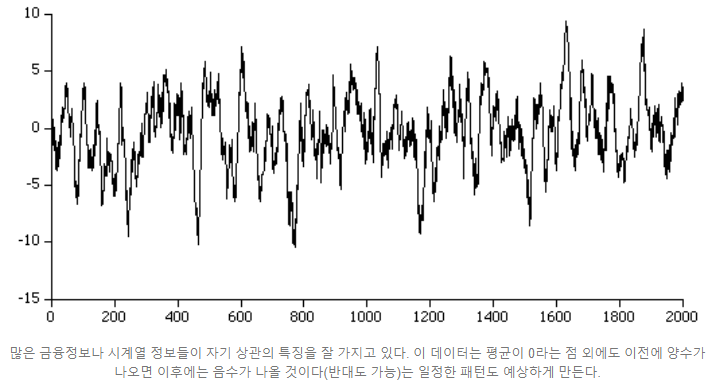
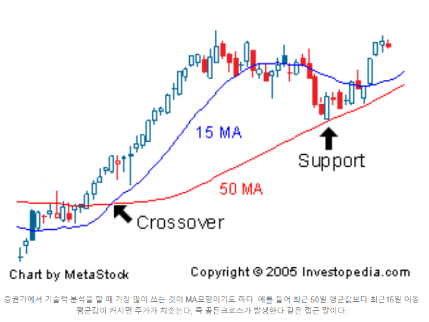
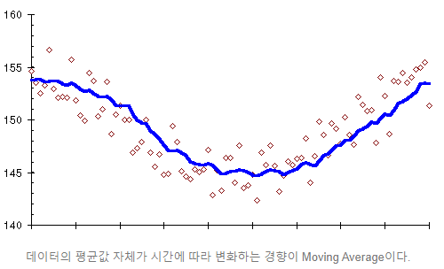

# 시계열

- 시계열이란?

> 가장 대표적인 시계열 데이터는 주식 데이터이다. `시계열은 일정 시간 간격으로 한 줄로 배열된 데이터를 의미` 라고 할 수 있다.

- 시계열 구성요소

> - **추세**(Trend) : 추세는 장기간 데이터의 일반적인 경향을 보여줍니다. 추세는 부드럽고 일반적인 장기적인 경향입니다. 짧은 구간에서 다른 변동을 보일 수 있지만 전체 추세는 상향, 하향 또는 안정적이어야합니다. 인구, 농업 생산, 제조 품목, 출생 및 사망자 수, 산업 또는 공장 수, 학교 또는 대학 수는 일종의 운동 경향을 보여주는 예입니다.
> - **순환**(Cyclic Variations ) : 1 년 이상 지속되는 시계열의 변동을 순환이라고 합니다. 이 변동은 1 년 이상의 주기를 갖습니다. Business cycle이라고 불리기도 합니다.
> - **계절성**(Seasonal Variations ) : 1 년 미만의 기간에 걸쳐 규칙적이고 주기적으로 나타나는 변동입니다. 이러한 변동은 자연의 힘이나 사람이 만든 관습으로 인해 시작됩니다. 다양한 계절 또는 기후 조건은 계절 변화에 중요한 역할을합니다. 농작물 생산량은 계절에 따라 달라지고, 여름에 선풍기와 에어컨의 판매량이 높아지고 겨울에 판매량이 낮아지는 특징을 보이는 것을 계절성이라고 합니다.
> - **불규칙 변동요인**(Random or Irregular movements) : 이 변동은 예측할 수없고 제어 할 수없고 예측할 수 없으며 불규칙합니다.

- 시계열 분석의 목적

> **1. 모형 수립(model building) : 관찰된 시계열의 성질을 조사, 확률적 특성을 체계화 해 적합한 시계열 모형을 찾는 것!**
>
> **2. 예측(forecasting) : 수립된 모형을 토대로 미래의 값을 제시하는 것!**
>
> - 회귀 분석과 다른점은?
>
>   > 시계열은 기본적으로 확률구조가 종속(독립X)이다. 앞의 데이터가 뒤의 데이터에 영향을 끼치지 회귀 분석처럼 다른 데이터가 어떤 한 데이터에 영향을 끼치는 것은 아니다.

### 대표적인 시계열 데이터의 특성과 모형

>  많은 연구자들이 시계열 정보를 크게 2가지로 쪼개어 규칙성을 가지는 패턴과 불규칙한 패턴의 결합이라고 여겨왔다. 따라서 시계열 모형은 전통적으로 이 두가지를 나누어서 개발되어 왔는데, 규칙성을 만드는 패턴을 또한 두가지로 쪼개어 **이전의 결과와 이후의 결과 사이에서 발생하는 자기상관성(Autocorrelativeness)**과 **이전에 생긴 불규칙한 사건이 이후의 결과에 편향성을 초래하는 이동평균(Moving Average)현상**으로 구분하고 있다. 한편, 많은 수계열 모형들이 불규칙한 패턴을 **White Noise**라고 칭하고 평균이 0이며 일정한 분산을 지닌 정규분포에서 추출된 임의의 수치라고 규정하고 있는데, 이러한 정규분포 가정은 모델의 해석을 전반적으로 편리하게 만들기 때문에 대부분의 통계 및 수리분석에서 채택되고 있다.
>
>  익히 알려진 대표적인 시계열 모델로는 AR모형, MA모형, ARMA모형, ARIMA모형이 있으며, 거의 대부분 시중에 존재하는 모형들은 이러한 기본 모형들의 특수해 또는 개량/변형한 것들에 해당된다. 이 대표모델의 시계열 움직임은 또한 정규분포 성질을 가지기 때문에 해석에서도 여러모로 편리하다.
>
> 

1. **자기상관(Autocorrelation) - AR모형**

>  자기상관이란 어떠한 Random Variable에 대해서 이전 의 값이 이후의 값에 영향을 미치고 있는 상황을 이야기한다. 예를 들면 이전에 값이 크면 이후에는 낮은 값이 나온다거나 하는 경향 따위를 말한다. 이러한 자기 상관은 바로 이전의 결과의 영향을 받을 수도 있지만, 드물게는 Delay가 발생하기도 한다. 우리가 실생활에서 가장 많이 발견하는 평균으로 돌아가려는 경향을 지닌 것들이다. 예를 들면 용수철을 원래 길이보다 길게 잡아당기면 이후는 반드시 용수철은 줄어드는 방향으로 반발하는 움직임을 보여 궁극적으로 원래 길이로 돌아가려고 한다.
>
>  자기상관성을 시계열 모형으로 구성한 것을 AR 모형이라고 부르는데, 가장 간단한 형태가 바로 직전 데이터가 다음 데이터에 영향을 준다고 가정한 AR(1)모형이다.
>
>  **X(t)={a\*X(t-1)+c}+u\*e(t)**
>
>  시점 t에서 얻게 될 X(t)의 평균값은 시점 t-1에서 얻었던 X(t-1)의 값에 a를 곱하고 c를 더한 것과 같다는 뜻이다. 여기서 e(t)항은 white noise라고 부르며 평균이 0이고 분산이 1인 정규분포에서 도출된 random한 값이다. 즉, X(t) 값은 평균이 a*X(t-1)+c이며 분산이 u인 정규 분포에서 도출되는 임의의 값이라는 뜻이다.
>
> 

2. **이동편균(Moving Average) - MA모형**

>  시간이 지날수록 어떠한 Random Varianble의 평균값이 지속적으로 증가하거나 감소하는 경향이 생길 수 있다. 예를 들어 봄에서 여름이 될 수록 일반적으로 가계 전기 수요량은 증가하는 경향이 있고 여름에서 겨울로 갈 수록 감소하는 경향이 있다. 우리는 특별히 전기세가 크게 부담되지 않는다면 전월의 전기 사용량이 다음월 전기 사용량에 상관을 주지는 않을 것이라고 가정할 수 있고, 아무래도 전기 사용량이 얼마가 될 것인지는 확실히 말하기 어렵기 때문에 이러한 경우 평균이동이 있는 시계열 데이터가 될 것이라고 생각해봄 직하다.
>
>  이동평균을 시계열 모형으로 구성한 것을 MA 모형이라고 부르는데, 가장 간단한 형태가 바로 직전 데이터가 다음 데이터에 영향을 준다고 가정한 MA(1)모형이다.
>
> **X(t)={a\**\*e(t-1)\**+c}+u\*e(t)**
>
>  시점 t에서 얻게 될 X(t)의 평균값은 시점 t-1에서 발생한 error e(t-1)의 값에 a를 곱하고 c를 더한 것과 같다는 뜻이다. 여기서 즉, X(t) 값은 평균이 a*e(t-1)이며 분산이 u인 정규 분포에서 도출되는 임의의 값이라는 뜻이다. AR(1)모형과 가장 결정적인 차이는 이전에 발생한 error가 중요한 것이지 결과적으로 X(t-1)이 무엇이엇는지는 중요하지 않다는 점이다.
>
> 
>
> 

3. **ARMA 모형**

>  ARMA모형은 Autoregressive Moving Average라는 뜻으로, AR모형과 MA모형을 합친 것으로, 연구 기관에서 가장 선호되는 모델이기도 하다. (통상 ARMA(2,2) 정도의 모델이면 충분히 양질의 데이터를 얻는다.)
>
> 가장 단순한 형태인 ARMA(1,1)모형은 아래와 같다.
>
> ​         **X(t)={a\*X(t-1)}+{b\*e(t-1)}+c+u\*e(t)**
>
> ARMA(2,2)모형은 아래와 같다.
>
> ​         **X(t)={a1\*X(t-1)+a2\*X(t-2)}+{b1\*e(t-1)+b2\*e(t-2)}+c+u\*e(t)**
>
> 

4. **ARIMA 모형**

>  ARIMA모형은 Autoregressive Integrated Moving Average라는 뜻으로, ARMA모형이 과거의 데이터들을 사용하는 것에 반해 ARIMA 모형은 이것을 넘어서서 과거의 데이터가 지니고 있던 '추세(Momentum)'까지 반영하게 된다. 즉, Correlation 뿐 아니라 Cointegration까지 고려한 모델이다.
>
>  Cointegration은 Correlation보다 설명하기가 더 어려운데, 가장 단순하게 설명하자고 하면 Correlation은 서로간에 선형관계를 설명하는 것이라면 Cointegration은 추세관계를 설명한다, 즉 cointegration인 시점이 고려되지 않으면 성립하지 않기 때문에 시계열 데이터에만 쓰이는 개념이다.
>
> - 선형관계
>   두 변수 X-Y간에 correlation이 0보다 크면 X가 큰 값이 나올 때 Y값도 큰 값을 가진다.
>   두 변수 X-Y간에 correlation이 0보다 작으면 X가 큰 값이 나올 때 Y값은 작은 갑을 가진다.
>
> - 추세관계
>   두 변수 X-Y간에 cointegration이 0보다 크면 X의 값이 이전 값보다 증가하면 Y값도 증가한다.
>   두 변수 X-Y간에 cointegration이 0보다 작으면 X의 값이 이전 값보다 증가하면 Y값은 감소한다.
>
>  ARIMA 모델은 자기 자신의 추세만 고려한다.white noise의 추세는 고려하지 않는다. 올바른 모델의 white noise는 추세가 존재하면 안되기 때문이다. 즉, Autoregressive는 자기 자신의 correlation을 말하는 것이고 Integrated 모델은 자기 자신의 cointegration을 말하는 것이다.