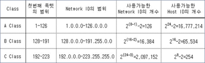

# IP

> Network = 네트워크 = '나' 와 다른 '너'와의 소통(왕복)
>
> 1. IP = Internet Protocol = 식별할 수 있는 숫자 = 주민등록 번호 = 절대 안겹친다.
> 	= 192.168.10.1 = Decimal Dotted Notation
> 	= 8bit.8bit.8bit.8bit=32bit = 2^32 = 4,294,967,296
> 	= 1Byte.1Byte.1Byte.1Byte =4 Byte
> 	= Octet.Octet.Octet.Octet =4 Octet
> 	= 2^8.2^8.2^8.2^8
> 	= 0~255.0~255.0~255.0~255
> 	= 256개.256개.256개.256개

- Classful Addres

> 
>
> ​								D Class(예약된 멀티캐스트 주소) : 224-239
>
> ​								E Class(예약된 연구용 주소) : 240-255
>
> - IPv4
>
> > =8bit.8bit.8bit.8bit=32bit = 2^32 = 42억 9천만개 .. < 전세계인구 70억  : 모잘르다...
> > =0~255.0~255.0~255.0~255
> >
> > => 서브넷팅과 IPV6로 모자란 IP를 충족시킨다.
>
> ---
>
> 0.0.0.0				   0 0000000.00000000.00000000.00000000
>
> 127.255.255.255 0 1111111.11111111.11111111.11111111	  A Class
>
> ---
>
> 128.0.0.0				 10 000000.00000000.00000000.00000000
>
> 191.255.255.255	10 111111.11111111.11111111.11111111    B Class
>
> ---
>
> 192.0.0.0				 110 00000.00000000.00000000.00000000
>
> 223.255.255.255	110 11111.11111111.11111111.11111111	C Class
>
> ---
>
> 224.0.0.0				 1110 0000.00000000.00000000.00000000
>
> 239.255.255.255	1110 1111.11111111.11111111.11111111	D Class
>
> ---
>
> 240.0.0.0				 1111 0000.00000000.00000000.00000000
> 255.255.255.255	1111 1111.11111111.11111111.11111111	E Class
>
> ---
>
> - Gateway
>   - 다른 대역대를 가기위한 최초 관문
>   - 출발지 IP와 게이트웨이 IP는 같은 대역대 여야만 한다.
>   - 게이트웨이 IP는 할당 가능한 대역대의 가장 마지막 주소를 쓴다.
>
> ---
>
> ex)
>
> 192.168.10.1/24
> C Class
> 255.255.255.0=/24
> N.A = 192.168.10.0
> B.A = 192.168.10.255
> 실제할당가능한 범위 = 192.168.10.1~254
> Gateway IP = 192.168.10.254

