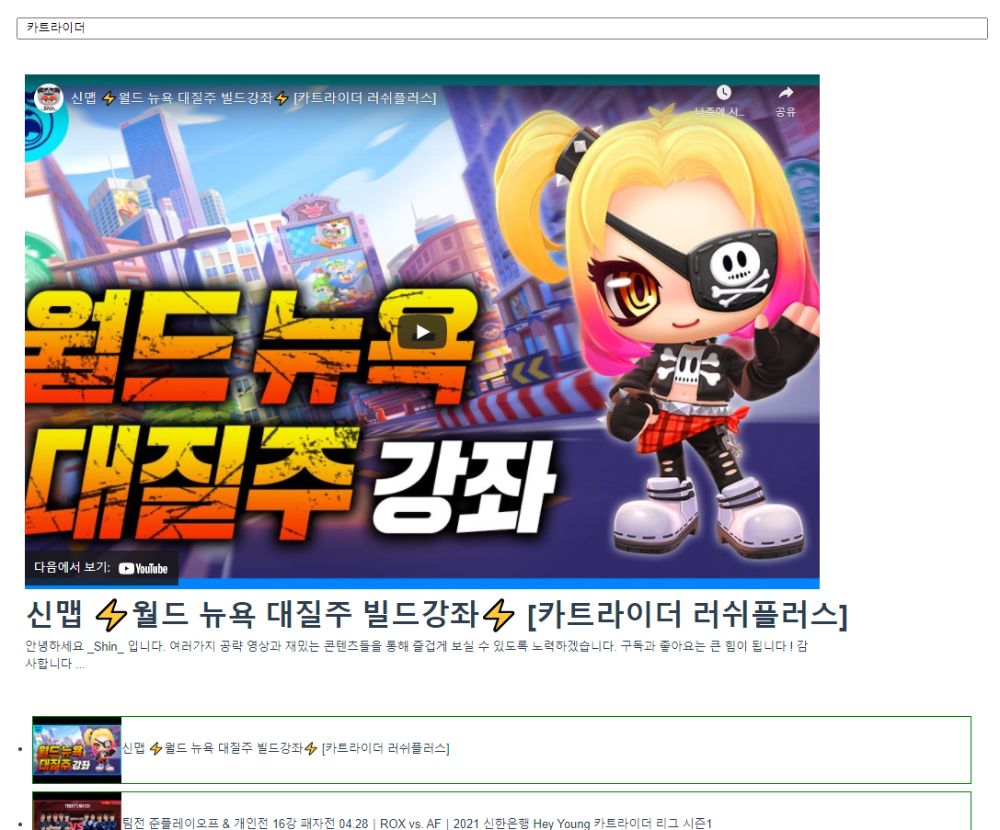
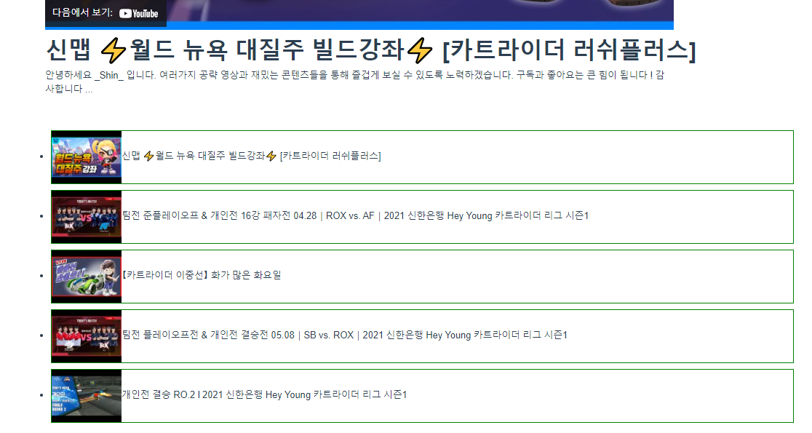

# Vuejs 를 이용해 유튜브 처럼 화면 구성하기






> 우선 기본적으로 검색 바 가 있고 동영상 플레이어 그리고 검색에 대한 내용들이 5개 정도 나와있다.


- 가장 최상위 component 가되는 App.vue 를 보도록 하자

```vue
<template>
  <div id="app" class="container">
    <TheSearchBar @send-query="requestSearch"/>
    <VideoDetail :selectedVideo="selectedVideo"/>
    <VideoList :videos="videos" @send-video-info="getVidoeInfo"/>
  </div>
</template>
```

> 총 3개의 컴포넌트를 자식으로 가지고 있다
>
> `TheSearchBar(검색바)` , `VideoDetail(현재 재생되고 있는 영상에대한 내용)` , `VideoList(검색에 대한 영상 리스트)` 
>
> 
>
> ```vue
> <TheSearchBar @send-query="requestSearch"/>
> ```
>
> `send-query` 라는 이벤트가 발생하면 `requestSearch` 함수를 실행하겠다.
>
> ```vue
> <VideoDetail :selectedVideo="selectedVideo"/>
> ```
>
> 자식 컴포넌트인 `VideoDetail` 에게 `selectdVideo` 라는 이름으로 `"selectedVideo"` 값을 보내겠다.
>
> ```vue
> <VideoList :videos="videos" @send-video-info="getVidoeInfo"/>
> ```
>
> 마찬가지로 `videos` 값을 보내고 `send-video-info` 이벤트 발생시 `getVideoInfo` 함수 실행하겠다.

```vue
<script>
import axios from 'axios'

import TheSearchBar from '@/components/TheSearchBar.vue'
import VideoDetail from '@/components/VideoDetail.vue'
import VideoList from '@/components/VideoList.vue'

const API_URL = 'https://www.googleapis.com/youtube/v3/search'
const API_KEY = process.env.VUE_APP_YOUTUBE_API_KEY

export default {
  name: 'App',
  components: {
    TheSearchBar,
    VideoDetail,
    VideoList,
  }, 
  data: function() {
    return {
      videos: [],
      selectedVideo: null,
    }
  },
  methods: {
    requestSearch : function(search) {
      axios.get(API_URL,{
        params: {
          key: API_KEY,
          part: 'snippet',
          q: search,
          type: 'video',
        }
      })
        .then(response =>{
          this.videos = response.data.items
        })
        .catch(error => {
          console.log(error)
        })
    },
    getVidoeInfo: function(video) {
      this.selectedVideo=video
    }
  }
}
</script>
```

> ```vue
> requestSearch : function(search){
> }
> ```
>
> 이부분에서 `search` 값은 자식 컴포넌트인 `TheSearchBar.vue` 에서 보낸 `searchData`이다.


- 자식 컴포넌트들을 살펴보자
  - TheSearchBar.vue

```vue
<template>
  <div class="row"> 
    <input type="text" v-model="searchData" @keydown.enter="sendQuery">
  </div>
</template>

<script>

export default {
  name: 'TheSearchBar',
  data: function() {
    return {
      searchData: '',
    }
  },
  methods: {
    sendQuery: function() {
        // send-query 이벤트를 발생시키고 this.searchData를 보낸다.
        // 여기서 보낸 searchData를 App.vue 의 requestSearch 함수에서 인자로 받는다.
      this.$emit('send-query',this.searchData)
    }
  }
}
</script>

<style>

</style>
```

​	

- VideoDetail.vue

```vue
<template>
  <div v-if="selectedVideo" class="row my-5">
    <div class="col-12 text-start">
      <iframe :src="videoUrl" frameborder="0" width="1080" height="700"></iframe>
    </div>
    <div class="col-12 text-start fs-1 fw-bold">
      {{ videoTitle }}
    </div>
    <div class="col-10 text-start">
      {{ videoDescriptions }}
    </div>
  </div>

</template>

<script>
    // lodash import
import _ from 'lodash'

export default {
  name: 'VideoDetail',
  props: {
    selectedVideo: Object,
  },
    // computed를 이용해 반환값으로 변수를 사용
  computed: {
    videoUrl: function() {
      const videoId = this.selectedVideo.id.videoId
      return `https://www.youtube.com/embed/${videoId}`
    },
    videoTitle: function() {
      return _.unescape(this.selectedVideo.snippet.title)
    },
    videoDescriptions: function() {
      return _.unescape(this.selectedVideo.snippet.description)
    }
  }

}
</script>

<style>

</style>
```

- VideoList.vue

```vue
<template>
  <div class="row">
    <ul class="text-center">
      <VideoListItem 
      @send-video-info="getVideoInfo"
      v-for="video in videos" 
      :video="video"
      :key="video.etag"/>
    </ul>    
  </div>
</template>

<script>
import VideoListItem from '@/components/VideoListItem.vue'

export default {
  name: 'VideoList',

  components: {
    VideoListItem,
  },
  props: {
    videos: Array,
  },
  methods: {
    getVideoInfo: function(video) {
      this.$emit('send-video-info',video)
    },    
  }
}
</script>

<style>

</style>
```

> ```vue
> <template>
>   <div class="row">
>     <ul class="text-center">
>       <VideoListItem 
>       @send-video-info="getVideoInfo"
>       v-for="video in videos" 
>       :video="video"
>       :key="video.etag"/>
>     </ul>    
>   </div>
> </template>
> ```
>
> v-for 를 이용한 반복문을 통해 여러개의 컴포넌트를  생성한다.
>
> key 값으로 유일한 값인 `video.etag` 를 사용

- VideoListItem.vue

```vue
<template>
  <li @click="sendVideoInfo" class="text-start item-list">
    
    <span>{{ textTitle }}</span>
  </li>
</template>

<script>
import _ from 'lodash'

export default {
  name: 'VideoListItem',
  props: {
    video: Object,
  },
  computed: {
    imgURL: function() {
      return this.video.snippet.thumbnails.default.url
    },
    textTitle: function() {
      return _.unescape(this.video.snippet.title)
    }
  },
  methods: {
    sendVideoInfo: function() {
      this.$emit('send-video-info',this.video)
    }
  }
}

</script>

<style scope>
  .item-list {
    cursor: pointer;
    border: 1px solid green;
    margin: 10px;
  }
</style>
```

