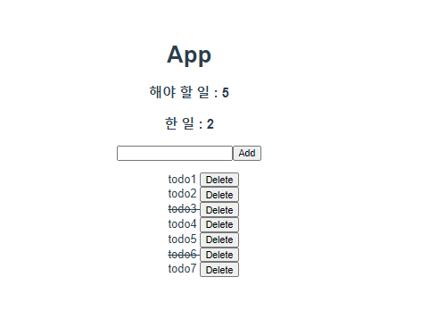
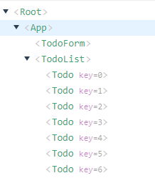

# Vuex

```bash
$ npm install vuex
$ vue create mypjt
$ vue add vuex
```


> Vuex 는 Vue.js 애플리케이션에 대한 `상태관리 패턴 + 라이브러리` 이다. 애플리케이션의 모든 컴포넌트에 대한 중앙 집중식 저장소 역할을 하며 예측 가능한 방식으로 상태를 변경할 수 있다. 또한 Vue의 공식 devtools 확장 프로그램과 통합되어 설정 시간이 필요없는 디버깅 및 상태 스냅 샷 내보내기/가져오기와 같은 고급 기능을 제공한다.
>
> - **State**
>   - 중앙에서 관리하는 모든 데이터(==상태)
>   - data
> - **Mutations**
>   - state를 변경하는 로직
>   - 동기적인 작업
>   - 첫 번째 인자로 항상 state를 받고 commit을 통해 호출한다.
> - **Getters**
>   - 저장소의 상태를 기준으로 계산해야 하는 값
>   - 실제 상태(data)를 변경하지 않는다.
>   - computed와 유사하다.
> - **Actions**
>   - state를 직접 변경하지 않고 mutations에 정의된 메서드를 호출해서 변경한다.
>   - 데이터 fetch 및 처리 & 가공, 비동기 작업
>   - 첫 번재 인자로 항상 context를 받고 dispatch로 mutations의 메서드를 호출한다.



- 기본 컴포넌트 구성



### Create

- TodoForm.vue

```vue
<template>
  <div>
    <input v-model="title" @keyup.enter="createTodo" type="text">
    <button @click="createTodo">Add</button>
  </div>
</template>

<script>
export default {
  name: 'TodoForm',
  data: function() {
    return {
      title: '',
    }
  },
  methods:{
    createTodo: function() {

      const item = {
        title: this.title,
        completed: false,
      }
      if (item.title.trim()) {       
        this.$store.dispatch('createTodo',item)
      }
      this.title=''

    },

  }

}
</script>

<style>

</style>
```

> `dispatch` 함수를 통해 `actions` 의  `createTodo`  함수 호출
>
> ```javascript
> // index.js
> actions: {
>     createTodo: function({commit}, todoItem) {
>       commit('CREATE_TODO',todoItem)
>     },
>   },
> ```
>
> 첫번째 인자로 context 를 받는데 그중 commit과 추가할 todoItem 을 인자로 받는다.
>
> `commit`함수를 통해 `mutations` 의 `CREATE_TODO` 함수 호출
>
> ```javascript
> mutations: {
>     CREATE_TODO: function (state,todoItem) {
>       state.todos.push(todoItem)
>     },
>   },
> ```
>
> 인자로 `state` 와 `todoItem` 을 받아 `state.todos` 에 추가한다.


### Delete

- Todo.vue

```vue
<template>
  <div>
    <li>
      <span @click="updateTodo(todo)" :class="{completed: todo.completed}">{{ todo.title }} </span>
      <button @click="deleteTodo(todo)">Delete</button>
    </li>
    
  </div>
</template>

<script>
import { mapActions } from 'vuex'

export default {
  name: 'Todo',
  props: {
    todo: {
      type: Object,
    }
  },
  methods: {
    // deleteTodo: function() {
    //   this.$store.dispatch('deleteTodo', this.todo)
    // },
    // updateTodo: function() {
    //   this.$store.dispatch('updateTodo', this.todo)
    // }
    ...mapActions([
      'deleteTodo',
      'updateTodo'
    ])
  }
}
</script>

<style>
  .completed {
    text-decoration: line-through;
  }

</style>
```

> `dispatch` 함수를 통해 호출이 가능하지만 `mapActions` 을 통해 간단하게 호출이 가능하다.
>
> ```javascript
> // index.js
> mutations: {
>     DELETE_TODO: function (state,todoItem){
>       const index = state.todos.indexOf(todoItem)
>       console.log(index)
>       state.todos.splice(index,1)
>     },
>   },
>   actions: {
>     deleteTodo: function({commit}, todoItem) {
>       commit('DELETE_TODO',todoItem)
>     },
>   },
> ```
>
> `splice(index,num)` : index 부터 num개의 데이터 삭제
>
> ### Update
>
> ```javascript
> mutations: {
>     UPDATE_TODO: function (state,todoItem){
>       state.todos = state.todos.map((todo) => {
>         if (todo === todoItem) {
>           return {...todo, completed: !todo.completed}
>         }
>         return todo
>       })
>     }
>   },
>   actions: {
>     updateTodo: function({commit}, todoItem) {
>       commit('UPDATE_TODO', todoItem)
>     },
>   },
> ```
>
> `return {...todo, completed: !todo.completed}` 
>
> todo 를 그대로 가져오되 completed의 값을 반대로 바꿔라
>
> - Todo.vue
>
>   ```vue
>   <template>
>     <div>
>       <li>
>         <span @click="updateTodo(todo)" :class="{completed: todo.completed}">{{ todo.title }} </span>
>         <button @click="deleteTodo(todo)">Delete</button>
>       </li>
>         
>     </div>
>   </template>
>   <style>
>     .completed {
>       text-decoration: line-through;
>     }
>   </stlye>
>   ```
>
>   `:class="{completed: todo.completed}"` : todo.completed가 참일 때만 class 이름을 completed로 해라.

### Getters

```javascript
// index.js
getters: {
    completedCount: function(state) {
      return state.todos.filter(function (todo) {
        return todo.completed === true
      }).length
    },
    uncompletedCount: function(state) {
      return state.todos.filter(function (todo) {
        return todo.completed === false
      }).length
    },
  },
      
// App.vue
computed: {
    completedCount: function() {
      return this.$store.getters.completedCount
    },
    uncompletedCount: function() {
      return this.$store.getters.uncompletedCount
    }
  }
```

completed 가 true 인 갯수와 false 인 갯수를 구하기 

### chrome local Storage 사용

```bash
npm install vuex-persistedstate
```

```javascript
// index.js
import createPersistedState from 'vuex-persistedstate'
'''
export default new Vuex.Store({
  plugins: [
    createPersistedState()
  ],
    '''
    
})
```

