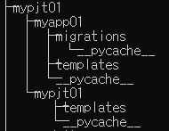

### django 초반 설정

- git bash

  > ``` bash
  > django-admin startproject mypjt01
  > python manage.py startapp myapp01
  > ```
  >
  > `mypjt01` 프로젝트가 생성되고 `myapp01` 앱 폴더가 생성된다
  >
  > 프로젝트 폴더 이름은 변경 가능하되 어플리케이션 폴더 이름은 수정 불가능!!!

- `mypjt01/mypjt01/settings.py` 설정

  > ```python
  > INSTALLED_APPS = [
  >     'myapp01',	#추가
  >     '''
  >     
  >     '''
  > ]
  > 
  > LANGUAGE_CODE = 'ko-kr'
  > TIME_ZONE = 'Asia/Seoul'
  > ```
  >
  > `myapp01` 경로 추가
  >
  > 위치와 시간동기화

- `mypjt01/mypjt01/urls.py` 설정

  > ```python
  > from django.contrib import admin
  > from django.urls import path,include
  > 
  > urlpatterns = [
  >     path('admin/', admin.site.urls),
  >     path('myapp01/',include('myapp01.urls'))
  > ]
  > ```
  >
  > `myapp01` 로 서버요청이 오면 `myapp01.urls`로 가라

- `mypjt01/myapp01/ursl.py` 파일 생성

  > ```python
  > from django.urls import path
  > from . import views
  > 
  > urlpatterns = [
  >     path('index/',views.index)
  > ]
  > ```

- `mypjt01/myapp01/views.py` 수정

  > ```python
  > def index(request):
  >     return render(request,'index.html')
  > ```

- `mypjt01/myapp01/templates/index.html`폴더 생성후 index.html 파일 생성

- 템플릿 확장

  > `mypjt01/mypjt01/templates/base.html` 설정 폴더안에 `templates`폴더 생성후 `base.html` 파일 생성
  >
  > ```html
  > <body>
  >   <h1>공통 부분</h1>
  >   
  >   
  > </body>
  > ```

- `mypjt01/mypjt01/settings.py` 경로설정

  ```python
  TEMPLATES = [
      {
          'BACKEND': 'django.template.backends.django.DjangoTemplates',
          'DIRS': [BASE_DIR / 'mypjt01' / 'templates'],
     '''
     
     '''
      }
  ]
  ```

- `mypjt01/myapp01/templates/index.html` 파일 수정

  ```html
  
  
  
  <h1>인덱스</h1>
  
  ```

- 현재 디렉토리 구조

  > 

### 템플릿 확장 하는 방법

1. 확장하는 템플릿이 위치할 폴더를 생성한다(택1)

   1. 프로젝트 폴더
   2. 설정 폴더

   - `DIRS`의 경로를 설정해 줘야 한다

   1-1 ` setting.py`에 폴더 경로를 잘 설정한다.

2. 공통적으로 사용되는 템플릿을 정의한다.(base.html)

   - `block` 을 설정해서 상이한 내용이 오는 공간을 확보한다.

3.  사용한다.

   - 템플릿 상단에 `` 을 추가한다.
     - 무조건 최상단에 위치할 수 있게 한다.
   - `block` 사이에 내용을 집어 넣는다.


### URL 분리

1. 설정 폴더의 `urls.py` 에서 분리 준비를 한다.
   - 상단 주석을 참고!! 설정을 한다.
2. application 폴더에 `urls.py` 파일을 생성
   - 기본 구조를 잡아줘야 한다.
   - `path` 함수를 사용하기 위한 import
   - `urlpatterns` 라는 리스트
3. 이제는 application 폴더의 `urls.py`에 경로를 등록하여 사용하면 된다.

