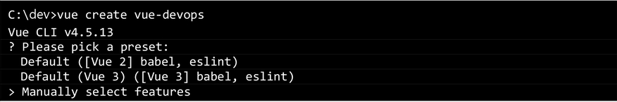
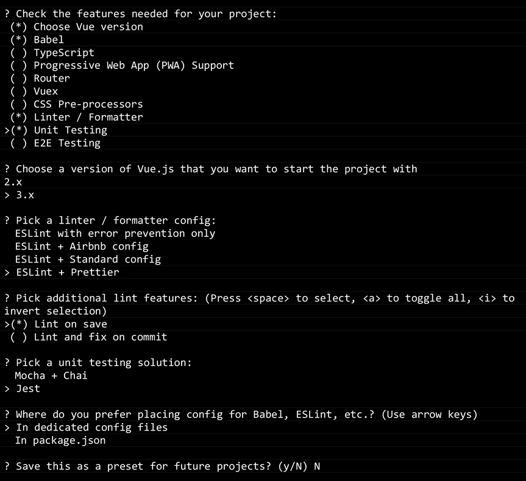
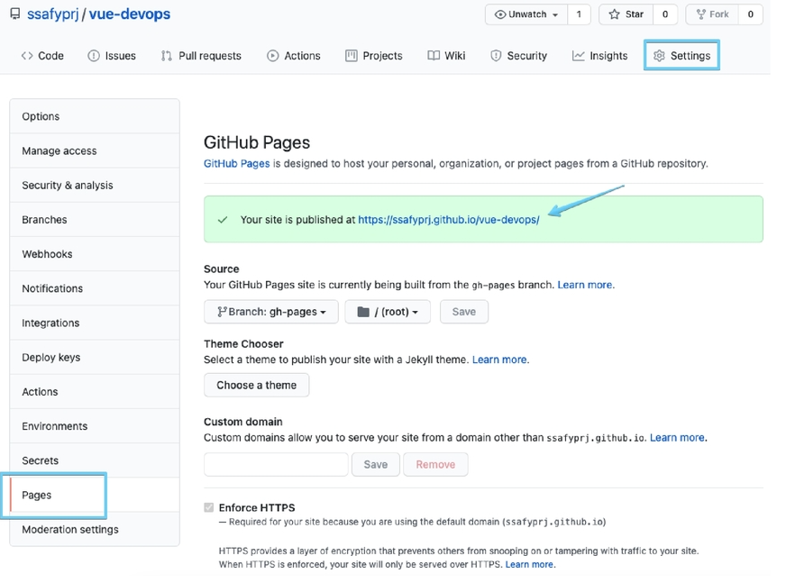
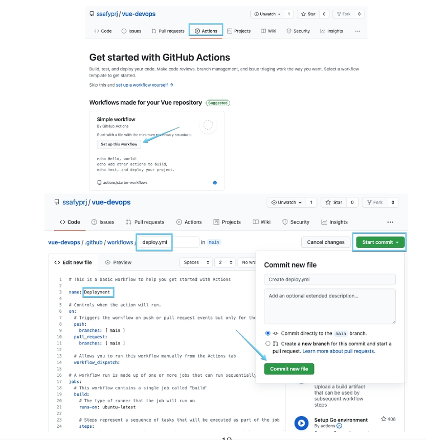

1. Vue 프로젝트 생성

```bash
$ vue create vue-devops
```






2. GitHub에 vue-devops 프로젝트 생성하기

3. 원경 저장소 설정(remote add) 및 코드 푸시하기

4. GitHub Pages로 배포하기 위한 라이브러리를 추가하고 package.json 에서 배포에 필요한 정보를 추가하기

   > ```bash
   > $ npm install gh-pages -D
   > ```
   >
   > - package.json 파일 수정
   >
   > ```javascript
   >   "name": "vue-devops",
   >   "version": "0.1.0",
   >   "private": true,
   >   "homepage": "https://seoljaehong8.github.io/vue-devops",
   >   "scripts": {
   >     "serve": "vue-cli-service serve",
   >     "build": "vue-cli-service build",
   >     "predeploy": "npm run build",
   >     "deploy": "gh-pages -d dist",
   >     "clean": "gh-pages-clean",
   >     "test:unit": "vue-cli-service test:unit",
   >     "lint": "vue-cli-service lint"
   >   },
   > ```

5. 배포용 publicPath 설정

   > 프로젝트 최 상단에 vue.config.js 파일을 생성
   >
   > - vue.config.js
   >
   > ```javascript
   > module.exports = {
   >   publicPath: "/vue-devops/",
   >   outputDir: "dist"
   > }
   > ```

6. npm run deploy 명령을 실행하면 빌드 된 정적 파일을 원격 저장소의 gh-pages 브랜치를 생성해서 푸쉬한다.

   > ```bash
   > $ npm run deploy
   > ```
   >
   > 

7. GitHub Actions workflow로 배포 자동화

   > 

8. git pull을 해 deploy.yml을 로컬에 다운받는다.

9. deploy.yml 파일 수정

   > ```yaml
   > # A workflow run is made up of one or more jobs that can run sequentially or in parallel
   > jobs:
   >   # This workflow contains a single job called "build"
   >   build:
   >     # The type of runner that the job will run on
   >     runs-on: ubuntu-latest
   > 
   >     # Steps represent a sequence of tasks that will be executed as part of the job
   >     steps:
   >       # Checks-out your repository under $GITHUB_WORKSPACE, so your job can access it
   >       - name: Checkout source code
   >         uses: actions/checkout@master
   > 
   >       - name: Set up Node.js
   >         uses: actions/setup-node@master
   >         with:
   >          node-version: 14.x
   > 
   >       - name: Install dependencies
   >         run: npm install
   > 
   >       - name: Test unit
   >         run: npm run test:unit
   > 
   >       - name: Build page
   >         run: npm run build
   >         env:
   >          NODE_ENV: production
   > 
   >       - name: Deploy to gh-pages
   >         uses: peaceiris/actions-gh-pages@v3
   >         with:
   >          github_token: ${{ secrets.GITHUB_TOKEN }}
   >          publish_dir: ./dist

10. 프로젝트 파일 수정후 push 하면 자동으로 배포가 완성된다.