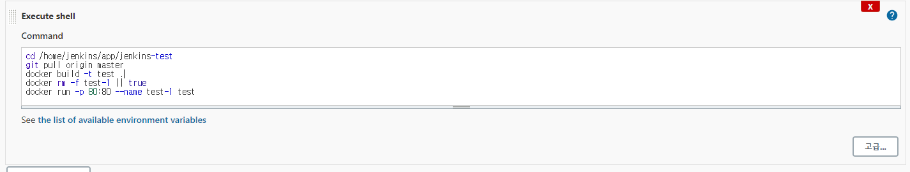

### Jenkins 기본

```bash
$ sudo docker pull jenkins/jenkins:lts

# 젠킨스 컨테이너안에서 새롭게 우리의 프로젝트 컨테이너를 구동시킬 것이기 때문에 docker.sock 파일을 볼륨해준다.
$ sudo docker run -d -p 8080:8080 -v /home/jenkins:/var/jenkins_home -v /var/run/docker.sock:/var/run/docker.sock -u root --name jenkins jenkins/jenkins

$ sudo docker logs jenkins
# 로그 중 비밀번호 확인후 8080번 포트로 접속한 후 로그인
```

> 젠킨스 컨테이너 접속해 도커를 설치해준다.

```bash
$ sudo docker exec -it jenkins /bin/bash

$ wget https://download.docker.com/linux/static/stable/x86_64/docker-20.10.7.tgz
$ tar xzvf docker-20.10.7.tgz

# bin 폴더에 옮겨 docker 명령어를 사용할 수 있도록 해준다.
$ mv docker/docker /usr/local/bin
# 저장공간 확보를 위해 삭제
$ rm -r docker docker-20.10.7.tgz
```


- 젠킨스 사이트에 들어가 새로운 item을 만든후 shell 작성(test 해보기)


/home/node/app:/var/jenkins_home


/home/jenkins/app:/home/node/app 

z6-kZpGiGDSmyWBqm3fD



