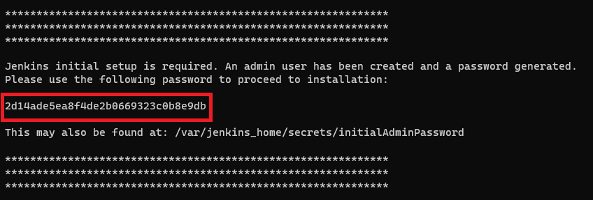
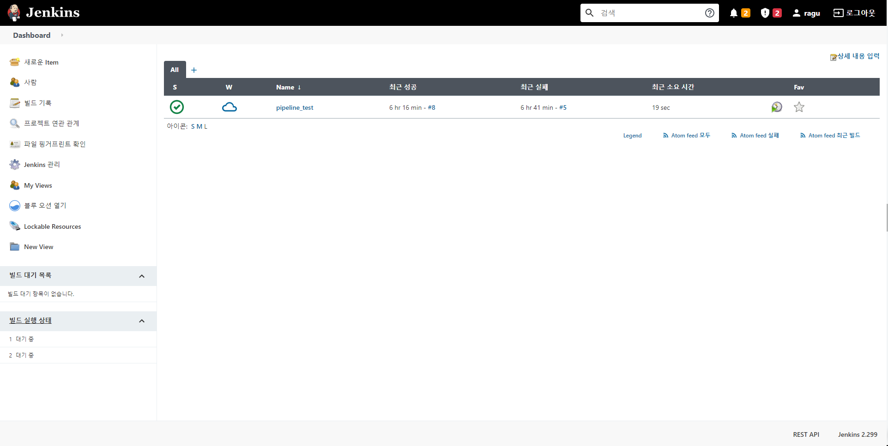
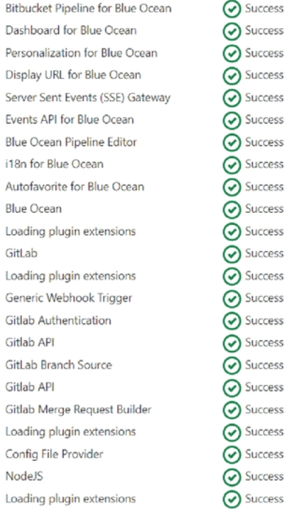
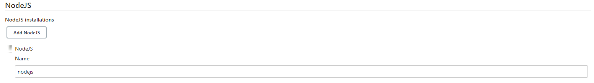
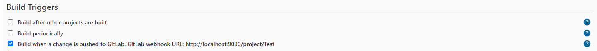
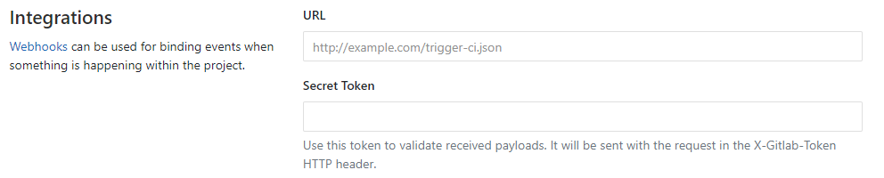
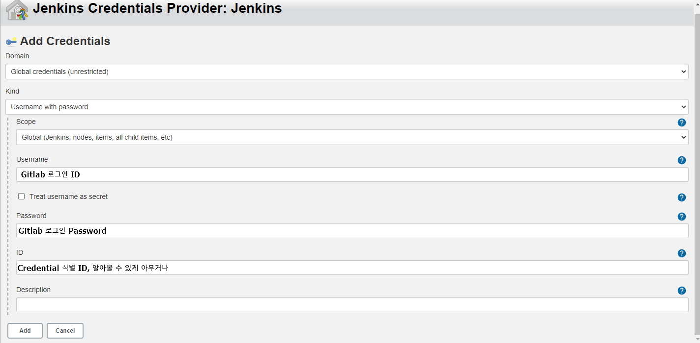
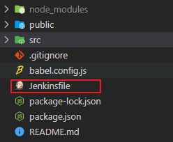
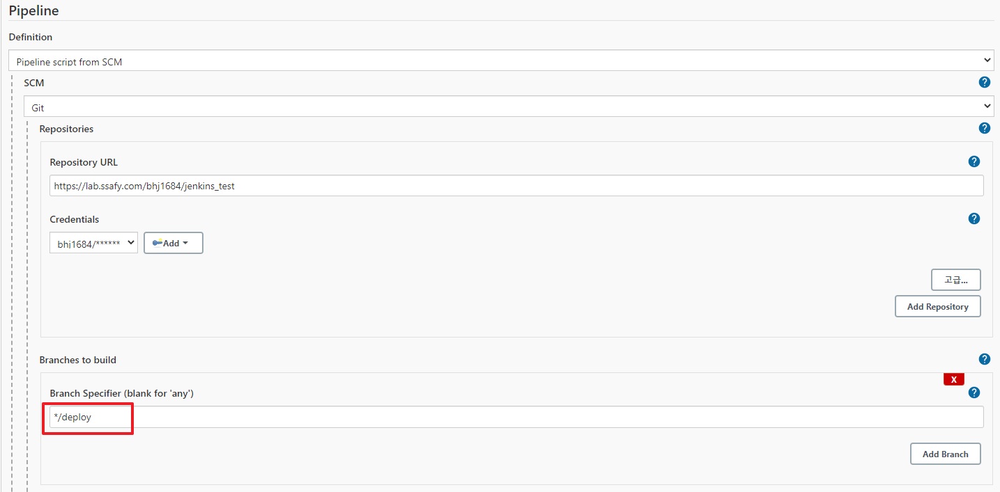

# Jenkins +  Gitlab 활용 CI/CD

> 필수 사항 : Docker

## 1. 프로젝트 배포 & 깃랩 저장소 생성

#### Vue 프로젝트 생성

```bash
vue create [ProjectName]
```

#### 프로젝트 build

```bash
npm run build
```

- dist 폴더 생성 및 경로 확인

#### nginx 컨테이너 생성

```bash
docker run --name nginx -d -p 80:80 -v [dist폴더경로]:/usr/share/nginx/html nginx
```

- localhost 로 접속해서 웹서버 구동 확인

#### Gitlab 저장소 생성 및 프로젝트 Push


## 2. Jenkins 컨테이너 생성 및 설정

#### 컨테이너 생성

```bash
docker run -d -u root -p 9090:8080 -v [dist폴더경로]:/tmp --name=jenkins jenkins/jenkins
```

#### jenkins 비밀번호 확인

```bash
docker logs jenkins
```



- localhost:9090 접속

- 확인한 비밀번호로 로그인

- Jenkins에서 제안하는 플러그인 설치

- 계정 생성 & 로그인



## 플러그인 설치

- Jenkins 플러그인 설치(http://localhost:9090/pluginManager/)
- 설치 후 꼭 재시작 필요(http://localhost:9090/restart/)

> Nodejs 와 Gitlab 관련 플러그인만 설치해도 됨.



## Nodejs 설정

- Jenkins 관리 > Global Tool Configuration(http://localhost:9090/configureTools/)
- NodeJS > Add NodeJS > Name - nodejs 입력 후 저장




## Pipeline 생성 및 저장소 연결

#### Pipeline 생성 및 Build Trigger 설정

- 새로운 Item > Pipeline 선택 > Item 생성

- Build Triggers > `Build when a change is pushed to GitLab...`체크

  

- 고급 > Secret token > Generate >  `Secret token` 생성

#### Gitlab 저장소 연결

- Gitlab 배포 저장소 > Settings > Integrations > webhook 추가

  - URL : [Jenkins_URL]/project/[Pipeline_NAME]

    > localhost 는 입력이 불가능 하기때문에 ngrok 을 이용해 포트포워딩 해준 URL을 입력한다.

  - Secret Token : 위에서 생성한 Secret Token 입력

  - webhook 생성 후 Test > `Push evnets` 확인, HTTP 200 이 출력되면 성공




#### Pipeline 설정

- Pipeline > Definition > Pipeline script from SCM 선택

  - Repository URL : 프로젝트 원격 저장소 URL
  - Credentials 생성 및 설정 : Add > Jenkins
    - Kind : Username with password 선택
    - Username : Gitlab 로그인ID / PASSWORD : Gitlab 로그인 Password
    - ID : Credentials 식별자

  

  - Branch Specifier : Evnet에 반응할 branch(default : */master)

- 저장


## 프로젝트 Jenkinsfile 생성

#### Jenkinsfile : Pipeline Script를 관리하는 파일

- 프로젝트 최상단 `Jenkinsfile` 생성 후 다음 코드 작성

```
pipeline {
    agent any
    tools{
        nodejs 'nodejs'
    }

    stages {
        stage('prepare') {
            steps {
                sh 'npm install'
            }
        }
        stage('build'){
            steps{
                sh 'npm run build'
                sh 'cp -r ./dist/*  /tmp'
            }
        }
    }
}
```

> 파일 위치



## Build 테스트

프로젝트 수정 및 Push 후 Jenkins의 Pipeline이 잘 작동하는지 확인합니다.


## 번외. 브랜치 관리

원격저장소의 master 브랜치가 아닌 deploy 용 브랜치를 생성해서 사용하는 방법.

#### Jenkins 설정

기존 */master > 수정 ***/deploy**



#### 원격저장소 브랜치 Push 명령어

```bash
git push origin master:deploy
```

```bash
git push [원격저장소] [로컬저장소_브랜치]:[원격저장소_브랜치]
```

