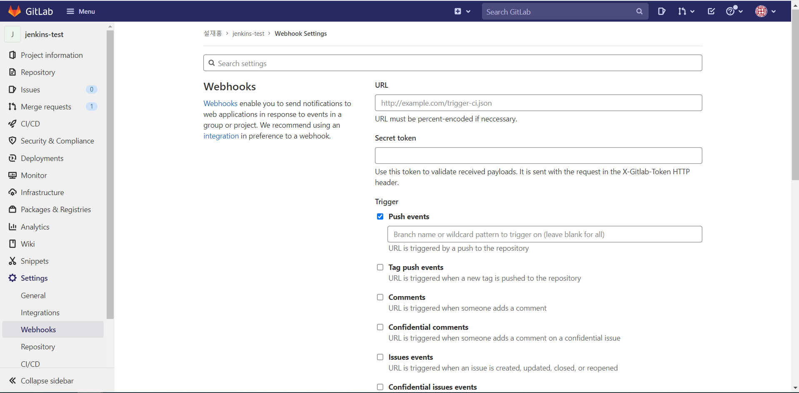
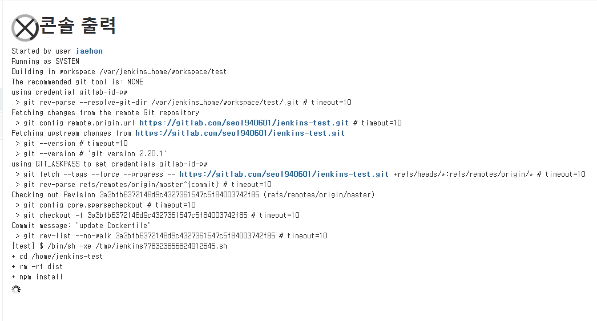
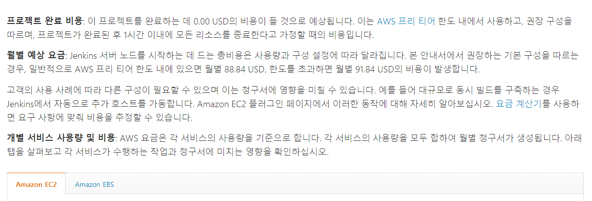
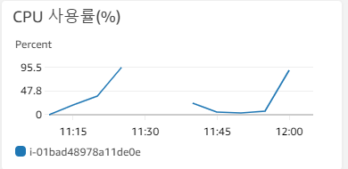
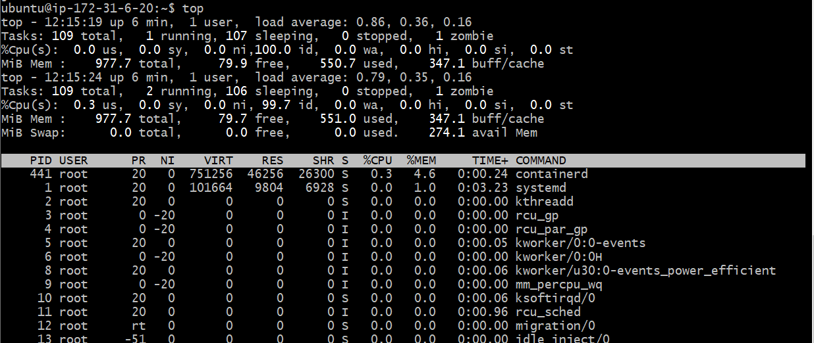
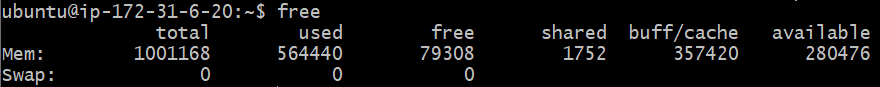
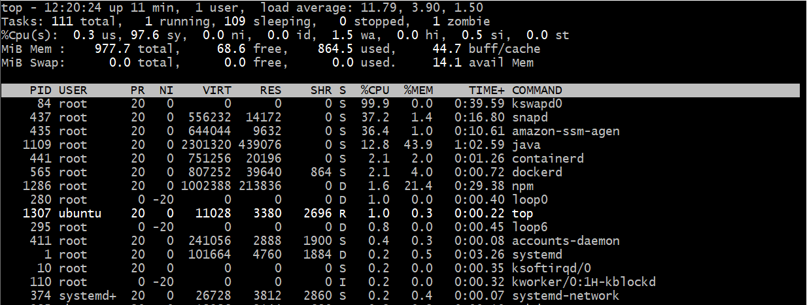
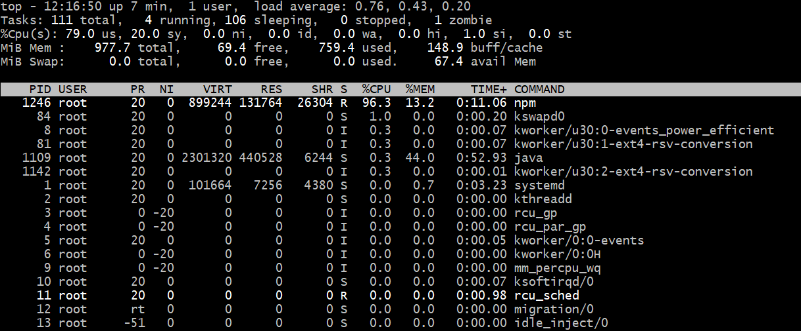
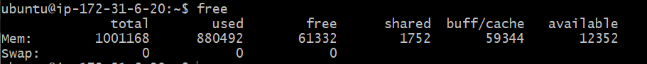

Jenkins

- 젠킨스 설치

```bash
# 도커를 통한 젠킨스 이미지 불러오기
$ sudo docker pull jenkins/jenkins:lts

# 젠킨스 컨테이너안에서 새롭게 우리의 프로젝트 컨테이너를 구동시킬 것이기 때문에 docker.sock 파일을 볼륨해준다.
$ sudo docker run -d -p 9090:8080 -v /home/jenkins:/var/jenkins_home -v /var/run/docker.sock:/var/run/docker.sock -v /usr/bin/docker:/usr/bin/docker  -u root --name jenkins jenkins/jenkins

$ sudo docker logs jenkins
# 로그 중 비밀번호 확인후 8080번 포트로 접속한 후 로그인
```


- 젠킨스 컨테이너에 접속후 도커 설치

```bash
$ sudo docker exec -it jenkins /bin/bash

$ wget https://download.docker.com/linux/static/stable/x86_64/docker-20.10.7.tgz
$ tar xzvf docker-20.10.7.tgz

# bin 폴더에 옮겨 docker 명령어를 사용할 수 있도록 해준다.
$ mv docker/docker /usr/local/bin
# 저장공간 확보를 위해 삭제
$ rm -r docker docker-20.10.7.tgz

$ cd /home

# git 유저정보를 저장
$ git config --global credential.helper store
$ git clone ~~~
# id, pw 입력 (보안을 위해 Acess Token을 발급받아 패스워드 대신 입력하자)
```


- 젠킨스접속
  - 로그를 통해 기록한 비밀번호 입력후 로그인
  - 접속후 기본 플러그인 설치
  - 계정 생성후 로그인


- 필요한 플러그인 설치

  - gitlab hook plugin, gitlab plugin, nodejs 설치

  - 설치한 nodejs 설정

    > Jenkins관리 -> global tool configuration


- 새로운 item 구성

  - 적절한 이름 으로 설정후 Freestyle project 선택

  - 소스코드 관리 -> Git -> gitlab url 입력 -> gitlab 아이디와 비밀번호로 credentials 생성

  - 빌드 유발 -> Build when a ~~~ 선택 -> 끝문장에 url 복사 -> 고급 클릭-> Secret token 복사

  - 빌드 환경 -> Provide Node & npm bin/ folder to PATH

  - 빌드 -> Add build step -> Execute shell -> 적당한 명령어 작성

    > ```bash
    > cd /home/jenkins-test
    > git pull origin master
    > npm install
    > npm run build
    > cp -r dist /var/jenkins_home/workspace/{jenkins item이름}/
    > ```

> 여기서 `cp -r dist /var/jenkins_home/workspace/test/`  해주는 이유는  젠킨스 서버의 이 폴더와 내 로컬 폴더의 `/home/jenkins/workspace/test` 이 경로가 현재 마운트 되고 있기 때문에 로컬에서 이 폴더로 nginx의 설정을 바꿔주기 위함이다
>
> - /etc/nginx/sites-available/default 수정
>
> ```bash
> server {
>         listen 80 default_server;
>         listen [::]:80 default_server;
> 
> 
>         root /home/jenkins/workspace/test/dist;
> 
>         index index.html index.htm index.nginx-debian.html;
> 
>         server_name _;
> 
>         location / {
>                 try_files $uri $uri/ /index.html;
>         }
> }
> ```
>
> ```bash
> $ sudo service nginx restart
> $ sudo systemctl enable nginx
> ```


# Gitlab

- 해당 레파지토리 - settings -> webhook



- 위에서 복사한 젠킨스 url 입력
- 위에서 복사한 secret token 입력
- push events 선택
- Add webhook 클릭후 밑에서 Test


# Error



위와 같이 `npm install` 에서 멈추는 현상 발생

예상하기로 ec2 를 프리티어로 쓰다보니 메모리가 부족한 듯 보인다.



aws 공식문서에서도 `jenkins 서버노드를  시작하는데 드는 총 비용은 사용량과 구성 설정에 따라 달라집니다. 본 안내서에서 권장하는 기본 구성을 따르는 경우, 일반적으로 AWS 프리티어 한도 내에 있으면 월별 88.84 USD, 한도를 초과하면 월별 91.84USD의 비용이 발생합니다.` 이렇게 적혀있는걸 보니 프리티어로는 부족한 듯 싶다.



CPU 사용률을 보니 확실히 build시 힘들어 하는걸 알 수 있다.


EC2 프리티어의 메모리는 1GB, 너무나도 작다. 이걸 해결하기 위해 SWAP 공간을 이용하도록 하겠다. AWS 공식 문서에도 SWAP 공간을 할당하는 방법이 나와있다.

[aws.amazon.com/ko/premiumsupport/knowledge-center/ec2-memory-swap-file/](https://aws.amazon.com/ko/premiumsupport/knowledge-center/ec2-memory-swap-file/)


- 젠킨스 돌리기전 메모리 및 CPU 상태






- 빌드 시 서버 상태








### 스왑 파일 생성

1. **dd** 명령을 사용하여 루트 파일 시스템에 스왑 파일을 생성합니다. 명령에서 **bs**는 블록 크기이고 **count**는 블록 수입니다. 스왑 파일의 크기는 **dd** 명령의 블록 크기 옵션에 블록 수 옵션을 곱한 값입니다. 이러한 값을 조정하여 원하는 스왑 파일 크기를 결정합니다. 지정한 블록 크기는 인스턴스에서 사용 가능한 메모리보다 작아야 합니다. 그렇지 않으면 "memory exhausted" 오류가 발생합니다.

   이 예제 **dd** 명령에서 스왑 파일은 4GB(128MB x 32)입니다.

```plainText
$ sudo dd if=/dev/zero of=/swapfile bs=128M count=32
```

2. 스왑 파일의 읽기 및 쓰기 권한을 업데이트합니다.

```plainText
$ sudo chmod 600 /swapfile
```

3. Linux 스왑 영역을 설정합니다.

```plainText
$ sudo mkswap /swapfile
```

4. 스왑 공간에 스왑 파일을 추가하여 스왑 파일을 즉시 사용할 수 있도록 합니다.

```plainText
$ sudo swapon /swapfile
```

5. 프로시저가 성공적인지 확인합니다.

```plainText
$ sudo swapon -s
```

6. **/etc/fstab** 파일을 편집하여 부팅 시 스왑 파일을 활성화합니다.

   편집기에서 파일을 엽니다.

```plainText
$ sudo vi /etc/fstab
```

​	파일 끝에 다음 줄을 새로 추가하고 파일을 저장한 다음 종료합니다.

```plainText
/swapfile swap swap defaults 0 0
```

