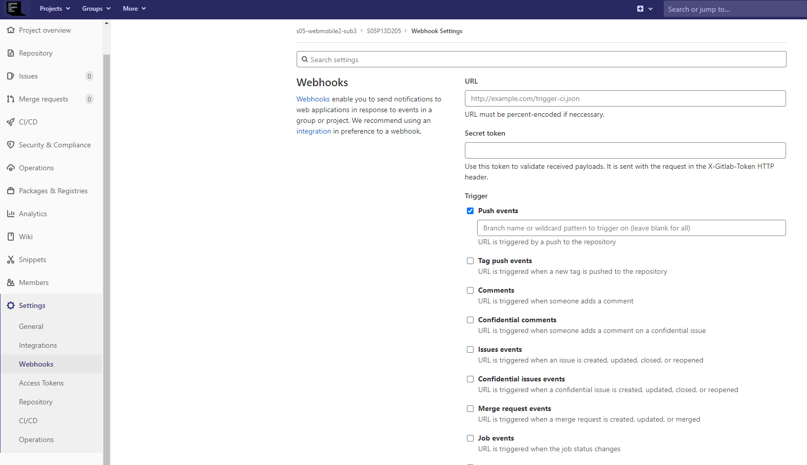
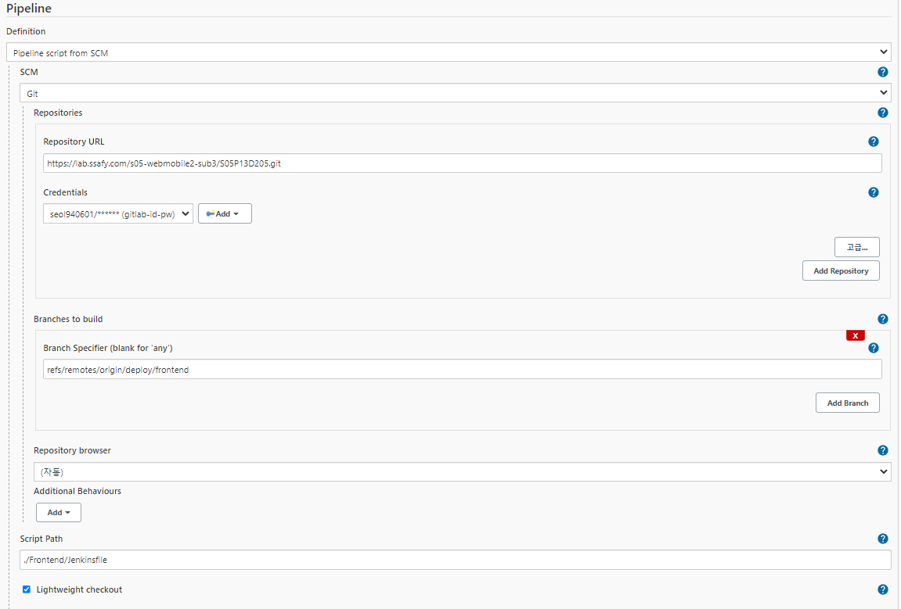
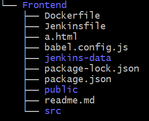
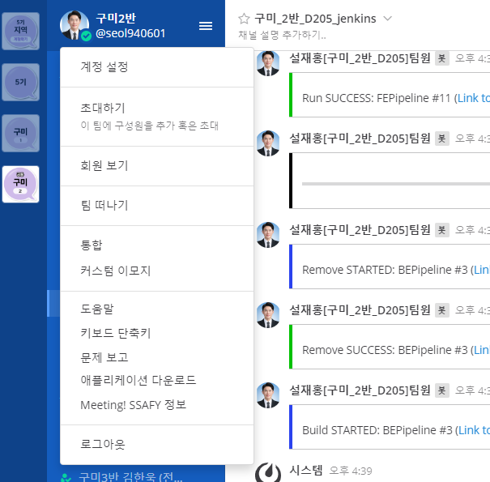
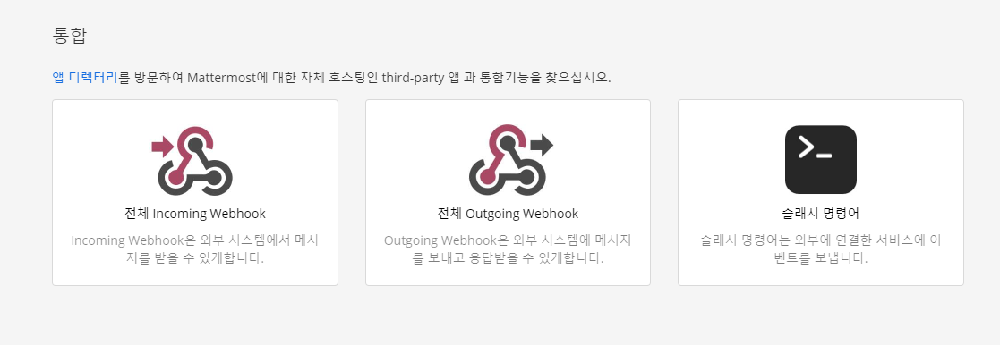
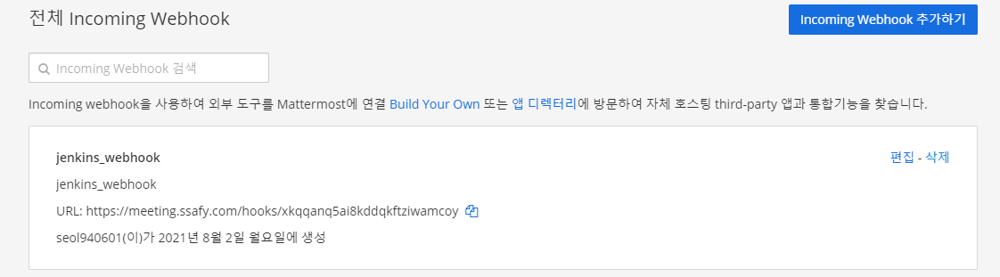
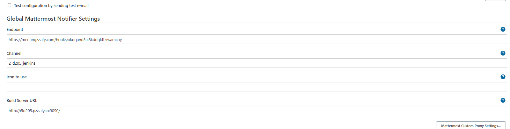
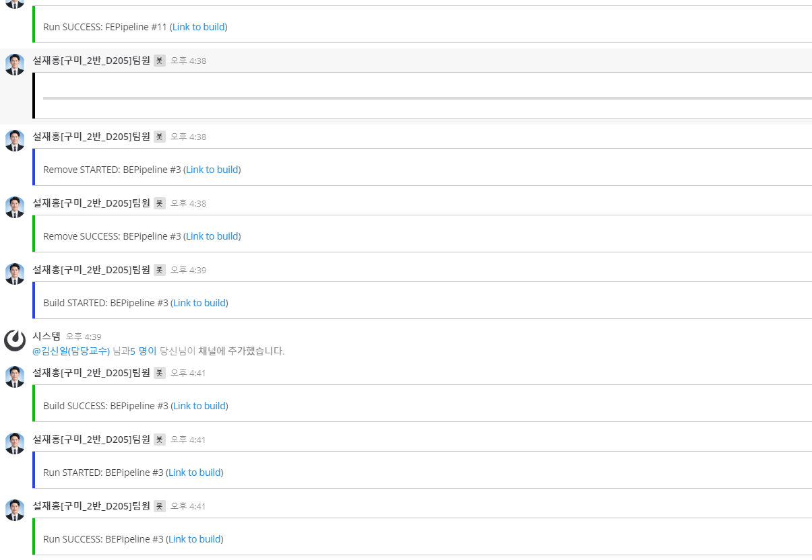

- jenkins 설치 후 접속

```bash
# 도커를 통한 젠킨스 이미지 불러오기
$ sudo docker pull jenkins/jenkins:lts

# 젠킨스 컨테이너안에서 새롭게 우리의 프로젝트 컨테이너를 구동시킬 것이기 때문에 docker.sock 파일을 볼륨해준다.
$ sudo docker run -d -p 9090:8080 -v /home/jenkins-data/:/var/jenkins_home -v /var/run/docker.sock:/var/run/docker.sock -v /usr/bin/docker:/usr/bin/docker  -u root --name jenkins jenkins/jenkins

$ sudo docker logs jenkins
# 로그 중 비밀번호 확인후 9090번 포트로 접속한 후 로그인
```


- 필요한 plugin 설치

  > gitlab 과 관련된 플러그인과 mattermost 연동을 위한 플러그인을 검색후 설치해준다.


- Pipeline 구성

  1. 새로운 Item 구성
  2. 적절한 이름 설정후 Pipeline선택 (frontend, backend 두개의 파이프 라인을 만들것이기 때문에 두개를 만들것이다.)
  3. Build Triggers에서 Build when a change~~~ 선택
  4. `Build when a ~~~` 끝에 있는 url 주소와 고급 탭을 눌렀을 시 마지막에 나타나는 Secret token을 Generate 버튼을 눌러 만든다음 복사하여 gitlab 웹 훅 설정
  5. 원하는 이벤트 선택후 웹훅을 추가한다.

  

  1. `Opened Merge Request Events` , `Build Only if new commits~~` 선택
  2. 고급탭을 눌러 `Allowed branches` - `Filter branches by name` 선택후 `Include` 안에 트리거를 설정할 적절한 브랜치 이름을 설정해준다 여기서는 `deploy/frontend` / `deploy/backend` (두개의 파이프라인을 만들어서 각각 설정)
  3. Credentials 설정은 Add 클릭후 kind를 Username with password로 선택시 깃랩 아이디와 패스워드로 설정 / gitlab API token 선택시 깃랩에서 Access Toekn을 발급후 설정

  6. Pipeline 설정 (Script path에 jenkins 파일 위치를 적어준다.)

  


- ubuntu 

  > ubuntu에서는 두개의 branch(`deploy/frontend`,`deploy/backend`)를 관리

  - deploy/frontend
  - 사진과 같이 가장 최 상단위치에 Dockerfile과 Jenkinsfile을 만든다.
  - backend도 마찬가지

  


- Dockerfile

  - Frontend

  ```bash
  # build stage
  FROM node:lts as build-stage
  
  # 이미지 내에서 명령어를 실행할 디렉토리 설정
  WORKDIR /home/node/app
  
  COPY package*.json ./
  
  # bable-plugin error 생길시
  # npm install @vue/babel-preset-app --save-dev
  
  # RUN npm install --production
  
  # RUN npm install -g @vue/cli-service
  
  RUN npm install
  
  COPY . .
  
  RUN npm run build
  
  
  # production stage
  FROM nginx:stable-alpine as production-stage
  
  COPY --from=build-stage home/node/app/dist /usr/share/nginx/html
  
  EXPOSE 80
  
  # 컨테이너 실행시 실행할 명령어
  CMD ["nginx", "-g", "daemon off;"]
  
  ```

  

  - Backend

  ```bash
  FROM openjdk:8-jdk-alpine as builder
  
  COPY gradlew .
  COPY gradle gradle
  COPY build.gradle .
  COPY settings.gradle .
  COPY src src
  RUN chmod +x ./gradlew
  RUN ./gradlew build
  
  FROM openjdk:8-jdk-alpine
  COPY --from=builder build/libs/Common_Project-0.0.1-SNAPSHOT.jar app.jar
  ENTRYPOINT ["java","-jar","/app.jar"]
  ```

  

- Jenkinsfile

  - 동작 순서는 docker에서 구동중인 컨테이너를 삭제후이미지 삭제 -> Dockerfile을 이용해 이미지 생성후 컨테이너 실행
  - Frontend (mattermost와 연동 안할 경우)

  ```bash
  pipeline {
      agent any
      stages {
          stage('Docker Remove'){
              steps{
                  sh 'docker stop frontend || true' 
                  sh 'docker rm -f frontend || true'
                  sh 'docker rmi frontend || true'
              }
          }
          stage('Docker Build'){
              steps{
                  sh 'docker build -t frontend .'
              }
          }
          stage('Docker run'){
              steps{
                  sh 'docker run -d -p 80:80 --name frontend frontend'
              }
          }
      }
  }
  ```

  - mattermost와 연동할 경우

  ```bash
  pipeline {
      agent any
      stages {
          stage('Docker Image Remove'){
              steps{
                  script {
                      try {    
                          mattermostSend (
                              color: "#000000", 
                              message: "************************************************************************"
                          )                      
                          mattermostSend (
                              color: "#2A42EE", 
                              message: "Remove STARTED: ${env.JOB_NAME} #${env.BUILD_NUMBER} (<${env.BUILD_URL}|Link to build>)"
                          )                   
                          sh 'docker stop frontend || true' 
                          sh 'docker rm -f frontend || true'
                          sh 'docker rmi frontend || true'
                      } catch(e) {
                          currentBuild.result = "FAILURE"
                      } finally {
                          if(currentBuild.result == "FAILURE") {
                              mattermostSend (
                                  color: "danger", 
                                  message: "Remove FAILED: ${env.JOB_NAME} #${env.BUILD_NUMBER} (<${env.BUILD_URL}|Link to build>)"
                              )
                          } else {
                              mattermostSend (
                                  color: "good", 
                                  message: "Remove SUCCESS: ${env.JOB_NAME} #${env.BUILD_NUMBER} (<${env.BUILD_URL}|Link to build>)"
                              )
                          }                            
                      }           
                  }
              }
          }
          stage('Build') {
             steps {  
                  script {
                      try {
                          mattermostSend (
                              color: "#2A42EE", 
                              message: "Build STARTED: ${env.JOB_NAME} #${env.BUILD_NUMBER} (<${env.BUILD_URL}|Link to build>)"
                          )                   
                          sh 'docker build -t frontend ./Frontend/'
                      } catch(e) {
                          currentBuild.result = "FAILURE"
                      } finally {
                          if(currentBuild.result == "FAILURE") {
                              mattermostSend (
                                  color: "danger", 
                                  message: "Build FAILED: ${env.JOB_NAME} #${env.BUILD_NUMBER} (<${env.BUILD_URL}|Link to build>)"
                              )
                          } else {
                              mattermostSend (
                                  color: "good", 
                                  message: "Build SUCCESS: ${env.JOB_NAME} #${env.BUILD_NUMBER} (<${env.BUILD_URL}|Link to build>)"
                              )
                          }                            
                      }           
                  }
              }      
          }
          stage('Docker Run'){
              steps{
                  script {
                      try {
                          mattermostSend (
                              color: "#2A42EE", 
                              message: "Run STARTED: ${env.JOB_NAME} #${env.BUILD_NUMBER} (<${env.BUILD_URL}|Link to build>)"
                          )                   
                          sh 'docker run -d -p 80:80 --name frontend frontend'
                      } catch(e) {
                          currentBuild.result = "FAILURE"
                      } finally {
                          if(currentBuild.result == "FAILURE") {
                              mattermostSend (
                                  color: "danger", 
                                  message: "Run FAILED: ${env.JOB_NAME} #${env.BUILD_NUMBER} (<${env.BUILD_URL}|Link to build>)"
                              )
                          } else {
                              mattermostSend (
                                  color: "good", 
                                  message: "Run SUCCESS: ${env.JOB_NAME} #${env.BUILD_NUMBER} (<${env.BUILD_URL}|Link to build>)"
                              )
                          }                            
                      }           
                  }
              }
          }
      }
  
  }
  ```

  

  - Backend

  ```bash
  pipeline {
      agent any
      stages {
          stage('Docker Image Remove'){
              steps{
                  script {
                      try {
                          mattermostSend (
                              color: "#000000", 
                              message: "*************************************************************************"
                          )     
                          mattermostSend (
                              color: "#2A42EE", 
                              message: "Remove STARTED: ${env.JOB_NAME} #${env.BUILD_NUMBER} (<${env.BUILD_URL}|Link to build>)"
                          )                   
                          sh 'docker stop backend || true' 
                          sh 'docker rm -f backend || true'
                          sh 'docker rmi backend || true'
                      } catch(e) {
                          currentBuild.result = "FAILURE"
                      } finally {
                          if(currentBuild.result == "FAILURE") {
                              mattermostSend (
                                  color: "danger", 
                                  message: "Remove FAILED: ${env.JOB_NAME} #${env.BUILD_NUMBER} (<${env.BUILD_URL}|Link to build>)"
                              )
                          } else {
                              mattermostSend (
                                  color: "good", 
                                  message: "Remove SUCCESS: ${env.JOB_NAME} #${env.BUILD_NUMBER} (<${env.BUILD_URL}|Link to build>)"
                              )
                          }                            
                      }           
                  }
              }
          }
          stage('Build') {
             steps {  
                  script {
                      try {
                          mattermostSend (
                              color: "#2A42EE", 
                              message: "Build STARTED: ${env.JOB_NAME} #${env.BUILD_NUMBER} (<${env.BUILD_URL}|Link to build>)"
                          )                   
                          sh 'docker build -t backend ./Backend/'
                      } catch(e) {
                          currentBuild.result = "FAILURE"
                      } finally {
                          if(currentBuild.result == "FAILURE") {
                              mattermostSend (
                                  color: "danger", 
                                  message: "Build FAILED: ${env.JOB_NAME} #${env.BUILD_NUMBER} (<${env.BUILD_URL}|Link to build>)"
                              )
                          } else {
                              mattermostSend (
                                  color: "good", 
                                  message: "Build SUCCESS: ${env.JOB_NAME} #${env.BUILD_NUMBER} (<${env.BUILD_URL}|Link to build>)"
                              )
                          }                            
                      }           
                  }
              }      
          }
          stage('Docker Run'){
              steps{
                  script {
                      try {
                          mattermostSend (
                              color: "#2A42EE", 
                              message: "Run STARTED: ${env.JOB_NAME} #${env.BUILD_NUMBER} (<${env.BUILD_URL}|Link to build>)"
                          )                   
                          sh 'docker run -d -p 8080:8080 --name backend backend'
                      } catch(e) {
                          currentBuild.result = "FAILURE"
                      } finally {
                          if(currentBuild.result == "FAILURE") {
                              mattermostSend (
                                  color: "danger", 
                                  message: "Run FAILED: ${env.JOB_NAME} #${env.BUILD_NUMBER} (<${env.BUILD_URL}|Link to build>)"
                              )
                          } else {
                              mattermostSend (
                                  color: "good", 
                                  message: "Run SUCCESS: ${env.JOB_NAME} #${env.BUILD_NUMBER} (<${env.BUILD_URL}|Link to build>)"
                              )
                          }                            
                      }           
                  }
              }
          }
      }
  
  }
  
  ```

  


- mattermost 연동

  > 통합 클릭



> Incoming Webhook 클릭



> url 주소 복사




> 젠킨스서버 접속후 Jenkins관리 -> 시스템 설정 -> Global MAtermost Notifier Settings
>
> 채널명은 메터모스트에서 채널 우클릭 후 링크복사해서 가장 마지막에 있는 내 채널을 쓰면 된다.



> 성공

