# 젠킨스를 사용한 Blue Ocean 빌드 & 배포 자동화

------


본 문서는 Jenkins 서버와 deploy 서버가 같은 클라우드 서버 내에 있습니다.

# Jenkins를 통한 수동 배포

------

## 1. deploy 서버에 Docker 설치 & Gitlab Repository Clone

이미 도커가 설치된 상황이라면 해당 과정을 건너 뛰셔도 무방합니다

- 다음 명령어를 실행한다.

```bash
$ sudo apt update
$ sudo apt upgrade
```

- 다음 패키지들을 설치한다.

```bash
$ sudo apt install apt-transport-https ca-certificates 
$ sudo apt install curl gnupg-agent software-properties-common
```

- Docker의 공식 GPG 키를 추가한다

```bash
$ curl -fsSL <https://download.docker.com/linux/ubuntu/gpg> | sudo apt-key add -
```

- `stable repository` 를 세팅하기 위한 명령어를 실행한다.

```bash
$ sudo add-apt-repository \\
	"deb [arch=amd64] <https://download.docker.com/linux/ubuntu> bionic stable"
```

- 가장 최신 버전의 Docker 엔진을 설치한 후, 버전을 확인한다.

```bash
$ sudo apt update
$ sudo apt install docker-ce docker-ce-cli containerd.io
$ docker -v
```

- Gitlab Repository를 클론한다.

```bash
$ git clone https://<your-repository>.git
```

## 2. Docker 컨테이너에 Jenkins 설치 및 진행

- Docker 컨테이너에 Jenkins 설치 후 구동

```bash
$ sudo docker run -d \\
	-u root \\
	-p 9090:8080 \\
	--name=jenkins \\
	-v /home/ubuntu/docker/jenkins-data:/var/jenkins_home \\
	-v /var/run/docker.sock:/var/run/docker.sock \\
	-v /usr/bin/docker:/usr/bin/docker \\
  jenkins/jenkins
```

- 또는 docker-compose.yml 작성 (명령어 대신 docker-compose 로 진행할 팀만 설정하세요)

```bash
version: '3.7'  # 도커 버전에 맞는 버전으로 작성한다.

services:
	jenkins:
		image: 'jenkins/jenkins'
		restart: unless-stopped
		user: root
		privileged: true
		ports:
			- '9090:8080'
		volumes:
			- '/home/ubuntu/docker/jenkins-data:/var/jenkins_home'
			- '/var/run/docker.sock:/var/run/docker.sock'
			- '/usr/bin/docker:/usr/bin/docker'
		container_name: 'jenkins'
```

-u root와 privileged: true 옵션으로 실행하지 않으면 추후 진행시 에러가 발생한다.

- http://<your-aws-domian>:<jenkins port> 접속 후 admin password 입력

```bash
$ sudo cat ~/docker/jenkins-data/secrets/initialAdminPassword
```

- jenkins 설치 (install suggested plugin)

## 3. Jenkins 플러그인 설치 및 환경설정

- Jenkins blue ocean 설치

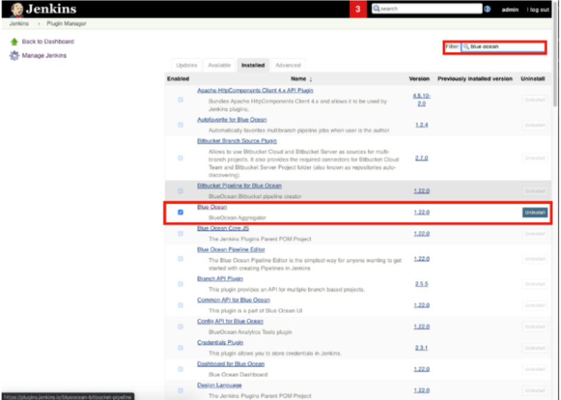

- Gitlab 설치

  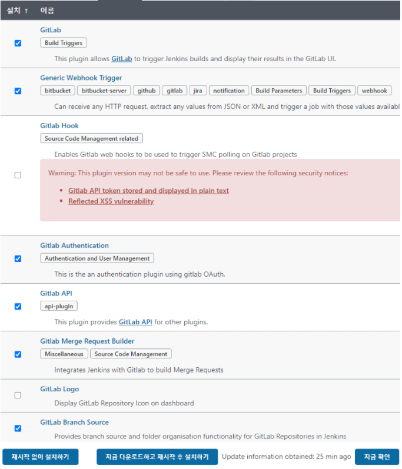

- jenkins 관리 → 시스템 설정에서 gitlab 관련 설정 추가

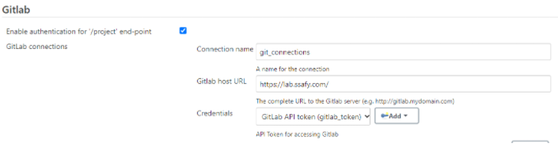

- 생성 시 발급된 토큰은 복사 후 로컬 PC에 저장

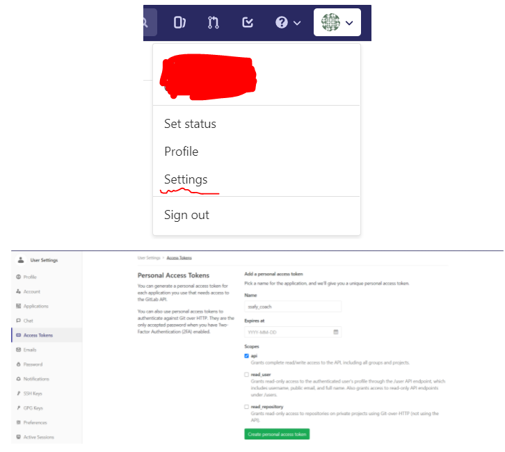


- Credentials는 Gitlab에서 발급받은 API token 입력

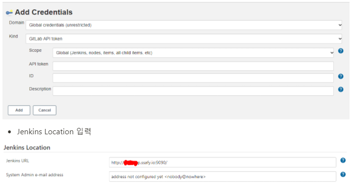

- Jenkins Location 입력

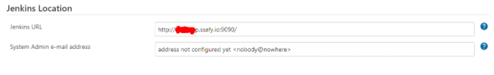

## 4. Jenkins와 Gitlab Repository 연결

- 새로운 item → pipeline 선택

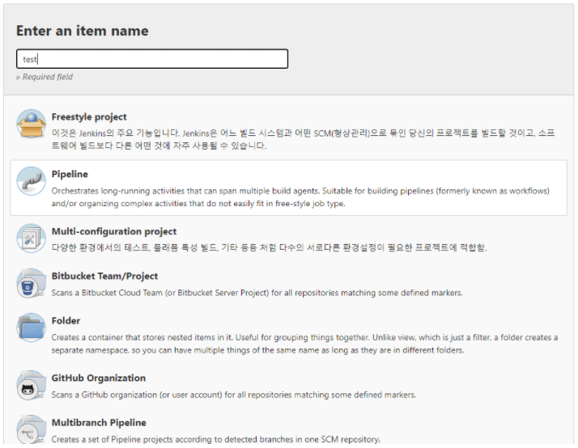

- Jenkins pipeline 설정 입력
- Repository URL은 Gitlab Repository URL 입력
- Credentials는 ADD 한 후 Username에는 gitlab id와 Password에는 access token 추가
- script path는 Jenkinsfile이 존재하는 폴더 위치

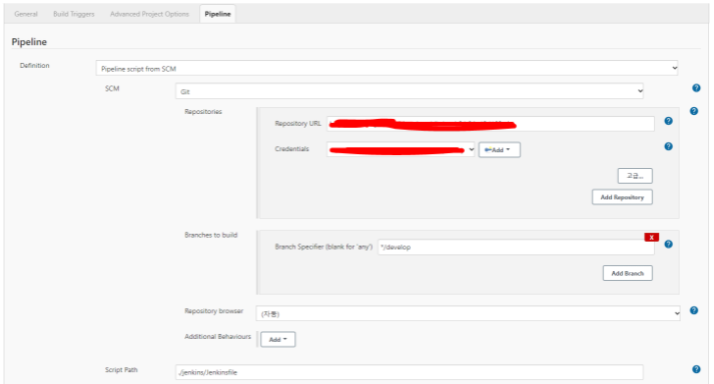

## 5. Gitlab 디렉토리에 Dockerfile 생성

- backend Dockerfile 생성

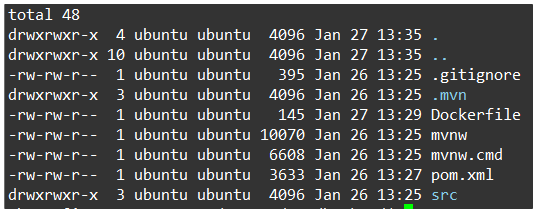

- backend Dockerfile 작성

```docker
FROM openjdk:8-jdk-alpine
VOLUME /tmp
ADD ./target/<pom.xml-artifactID>-0.0.1-SNAPSHOT.jar app.jar
ENV JAVA_OPTS=""
ENTRYPOINT ["java", "-jar", "/app.jar"]
```

- frontend Dockerfile 생성

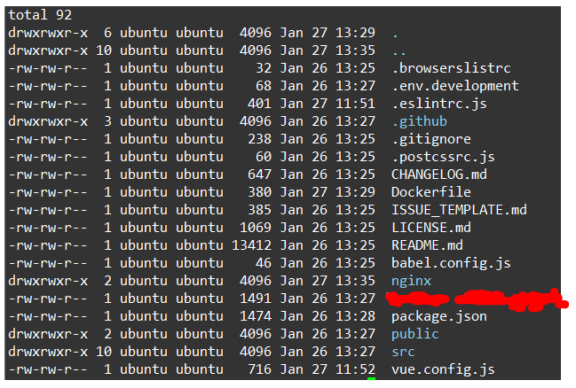

- frontend Dockerfile 작성

```docker
FROM node:lts-alpine as build-stage
WORKDIR /hompage
COPY package*.json ./

RUN npm install
COPY . .
RUN npm run build

FROM nginx:stable-alpine as production-stage
RUN rm /etc/nginx/conf.d/default.conf
COPY ./nginx/homepage.conf /etc/nginx/conf.d/homepage.conf

COPY --from=build-stage ./homepage/dist /usr/share/nginx/html/homepage
EXPOSE 80
CMD ["nginx", "-g", "daemon off;"]
```

- frontend ./nginx/homepage.conf 작성

```go
server {
	listen 80;

	location / {
		alias /usr/share/nginx/html/homepage/;
		try_files $uri $uri/ /index.html;
	}
	
	location /api {
		proxy_pass <http://base-pjt-back:8080>;

		proxy_http_version 1.1;
		proxy_set_header Connection "";
		proxy_set_header Host $host;
		proxy_set_header X-Real-IP $remote_addr;
		proxy_set_header X-Forwarded-For $proxy_add_x_forwarded_for;
		proxy_set_header X-Forwarded-Proto $scheme;
		proxy_set_header X-Forwarded-Host $host;
		proxy_set_header X-Forwarded-Port $server_port;
	}
}
```

- Jenkinsfile 생성

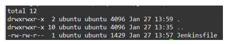

- Jenkinsfile 작성 (주석은 작성하지 않아도 됩니다)

```go
// 젠킨스 파이프라인 플러그인을 호출하기 위한 블록
pipeline {
	// 파이프라인을 실행하고 싶은 위치 정의
	agent none
	// gitlab의 소스를 jenkins 디렉토리로 내려받을 시
	// skipDefaultCheckout(true)일 경우 내려받는 프로세스 skip
	// skipDefaultCheckout(false)일 경우 gitlab 소스 체크
	options { skipDefaultCheckout(true) }
	// stage의 모음
	stages {
		// 실제 작업이 수행되는 블록
		// 해당 stage 명으로 jenkins 화면에 표시된다
		stage('Build and Test') {
			// docker image에 명시된 image를 활용하여 steps 수행
			agent {
				docker {
					image 'maven:3-alpine'
					args '-v /root/.m2:/root/.m2'
				}
			}
			options { skipDefaultCheckout(false) }
			steps {
				sh 'mvn -B -DskipTests -f <your-pom.xml-directory> clean package'
			}
		}
		stage('Docker build') {
			agent any
			steps {
				sh 'docker build -t <front-image-name>:latest <front dockerfile path>'
				sh 'docker build -t <back-image-name>:latest <back dockerfile path>'
			}
		}
		stage('Docker run') {
			agent any
			steps {
				// 현재 동작중인 컨테이너 중 <front-image-name>의 이름을 가진
				// 컨테이너를 stop 한다
				sh 'docker ps -f name=<front-image-name> -q \\
					| xargs --no-run-if-empty docker container stop'
				// 현재 동작중인 컨테이너 중 <back-image-name>의 이름을 가진
				// 컨테이너를 stop 한다
				sh 'docker ps -f name=<back-image-name> -q \\
					| xargs --no-run-if-empty docker container stop'
				// <front-image-name>의 이름을 가진 컨테이너를 삭제한다.
				sh 'docker container ls -a -f name=<front-image-name> -q \\
					| xargs -r docker container rm'
				// <back-image-name>의 이름을 가진 컨테이너를 삭제한다.
				sh 'docker container ls -a -f name=<back-image-name> -q \\
					| xargs -r docker container rm'
				// docker image build 시 기존에 존재하던 이미지는
				// dangling 상태가 되기 때문에 이미지를 일괄 삭제
				sh 'docker images -f "dangling=true" -q \\
					| xargs -r docker rmi'
				// docker container 실행
				sh 'docker run -d --name <front-image-name> -p 80:80 <front-image-name>:latest'
				sh 'docker run -d --name <back-image-name> -p 8080:8080 <back-image-name>:latest'
			}
		}
	}
}
```

```bash
// gradle
stage('Build and Test') {
            agent {
                docker {
                    image 'gradle:6.7.1-jdk8-openj9'
                    args '-v /root/.gradle:/root/.gradle'
                }
            }
            options { skipDefaultCheckout(false) }
            steps {
                sh 'gradle build'
            }
        }
```


## 6. 소스코드 Push 후 수동 배포

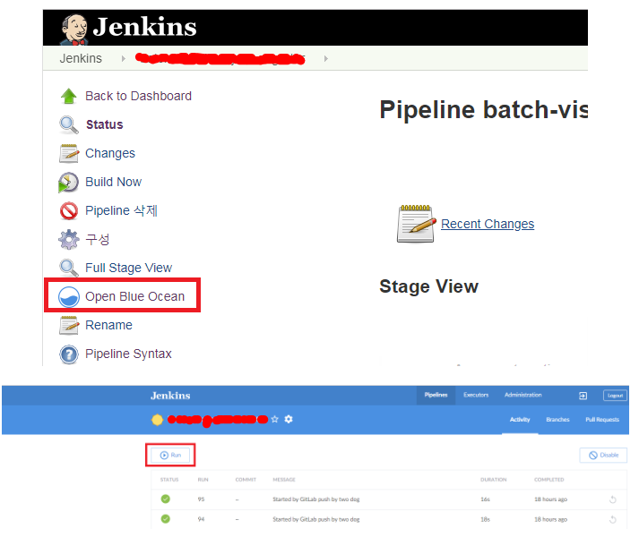

## 7. Jenkins Build Triggers 설정

- Build when a change is pushed to Gitlab webhook 체크

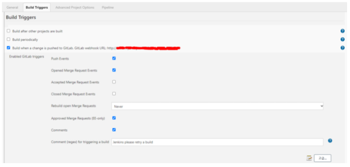

- Build Triggers 고급... 클릭 후
- include에서 webhook 브랜치 선택
- 우측 아래 Generate 클릭

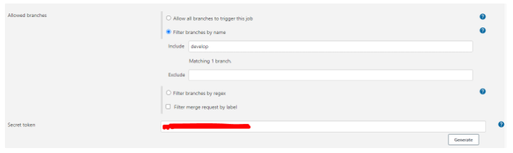

## 8. Gitlab에서 Webhook 설정

- 프로젝트에서 Settings → Integrations 선택
- URL은 Build Triggers 설정 시 보였던 Gitlab Webhook URL 입력
- Secret token은 Build Triggers 설정 시 생성했 던 Secret Token 입력

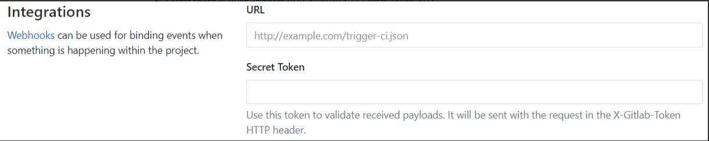

- Webhook 테스트 후 200 리턴 시 정상 작동

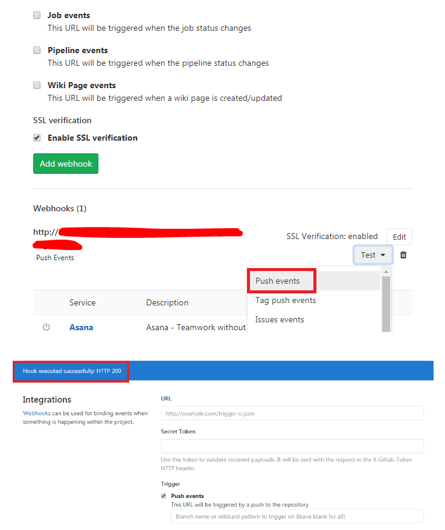