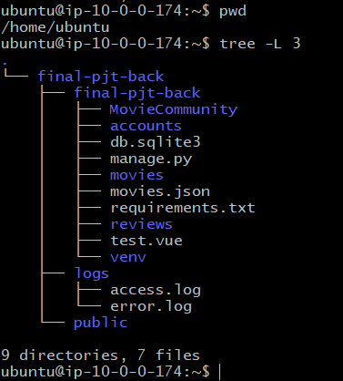

### cmd 에서 접속

```shell
> ssh -i ssh -i .\aws_daum_administrator_pwd.pem ubuntu@54.209.132.174
```

### apahce 설치

```shell
$ sudo apt-get update
$ sudo apt install upgrade
$ sudo atp-get install apahce2
$ sudo service apache2 (start,stop,restart)

# 켜져있는지 확인
$ ps aux | grep apache2
# 패키지 설치 확인
$ dpkg -l | grep apache2
```

### demon 프로그램 확인

```shell
$ ls /etc/init.d

$ sudo service --status-all | grep +
```

> etc/init.d 는 디렉토리는 daemon 프로그램들이 있는 디렉토리
>
> 실행되고 있는 프로그램들


### firewalld

```shell
$ sudo apt install firewalld -y

# 버전확인
$ sudo firewall-cmd --version

# 새로운 rule 적용
$ sudo firewall-cmd --permanent --zone=public --add-port=80/tcp
$ sudo firewall-cmd --reload
 
# 모든 값 조회
$ sudo firewall-cmd --list-all
```


### apt, apt-get 차이

> apt는 apt-get과 apt-cache의 기능 중에서 잘 사용되지 않는 기능을 제외하고 만든 새로운 tool이다.
> 여기서 apt-get은 패키지 설치를 담당하고, apt-cache는 패키지 검색을 담당하는 tool이다.
> 결론적으로 apt-get이 아닌 apt를 사용하는 것이 사용성 측면에서는 유리하다.


### python(apach2,django 연결)

> ubuntu에는 python3.8.5가 설치 되어있다
>
> - 가상환경 설치 및 장고 설치
>
> > ```shell
> > $ sudo apt-get install python3-venv -y
> > $ mkdir /home/ubuntu/final-pjt-project/final-pjt-project
> > 
> > $ python3 -m venv venv
> > $ source venv/bin/activate
> > 
> > (venv) $ pip install --upgrade pip
> > (venv) $ pip install django
> > 
> > (venv) $ cd /home/ubuntu/final-pjt-project/final-pjt-project
> > (venv) $ django-admin startproject MovieCommunity
> > ```
> >
> > - settings.py 수정
> >
> > ```python
> > ALLOWED_HOSTS = ['*'] # 모든 아이피에서 접속허용
> > # 나중에는 현재 우분투 서버의 IP를 넣을것이다.
> > ```
> >
> > - apach2 설정 파일 수정
> >
> > ```shell
> > (venv) $ sudo apt install libapache2-mod-wsgi-py3
> > (venv) $ sudo vi /etc/apache2/sites-available/000-default.conf
> > 
> > # 수정
> > <VirtualHost *:80>
> > 
> >         ErrorLog /home/ubuntu/final-pjt-back/logs/error.log
> >         CustomLog /home/ubuntu/final-pjt-back/logs/access.log combined
> > 
> >         <Directory /home/ubuntu/final-pjt-back/final-pjt-back/MovieCommunity/>
> >                 <Files wsgi.py>
> >                         Require all granted
> >                 </Files>
> >         </Directory>
> > 
> >         # python-path:장고프로젝트 폴더 위치 / python-home:가상환경 venv 위치
> >         WSGIDaemonProcess final-pjt-back python-path=/home/ubuntu/final-pjt-back/final-pjt-back python-home=/home/ubuntu/final-pjt-back/final-pjt-back/venv
> >         WSGIProcessGroup final-pjt-back
> >         WSGIScriptAlias / /home/ubuntu/final-pjt-back/final-pjt-back/MovieCommunity/wsgi.py
> > 
> > 
> > </VirtualHost>
> > ```
> >
> > ```bash
> > $ sudo service apache2 restart
> > ```
> >
> > db 퍼미션 변경
> >
> > ```bash
> > $ chmod 664 db.sqlite3
> > $ sudo chown www-data:www-data db.sqlite3
> > $ sudo chown www-data:www-data ~/final-pjt-back/final-pjt-back
> > ```
> >
> > ```bash
> > # cors error
> > # /etc/apache2/apache2.conf 추가하기
> > WSGIPassAuthorization On
> > ```
> >
> > 
> >
> > - tree
> >
> > ```bash
> > $ sudo apt install tree
> > ```
> >
> > 옵션
> >
> > - -d	: 디렉토리만 표시
> > - -F    : 디렉토리 경로 표시
> > - -i   
> > - -l {pattern}
> > - -L {lavel}
> > - -P {pattern}
> >
> > 현재 폴더 구조
> >
> > 
> >
> > 
>
> - admin 페이지 css 적용 안될때
> - settings.py
>
> ```python
> # /etc/apache2/apache2.conf
>  Alias /static/ /home/ubuntu/final-pjt-back/final-pjt-back/venv/lib/python3.8/site-packages/django/contrib/admin/static/
>         <Directory /home/ubuntu/final-pjt-back/final-pjt-back/venv/lib/python3.8/site-packages/django/contrib/admin/static>
>                 Require all granted
>         </Directory>
> 
> ```
>
> venv/lib/python3.8/site-packages/django/contrib/admin/static

https://blog.naver.com/PostView.nhn?blogId=semtul79&logNo=221485859880&categoryNo=11&parentCategoryNo=0&viewDate=&currentPage=1&postListTopCurrentPage=1&from=section


디비설정

https://yuddomack.tistory.com/entry/%EC%B2%98%EC%9D%8C%EB%B6%80%ED%84%B0-%EC%8B%9C%EC%9E%91%ED%95%98%EB%8A%94-EC2-nginx%EC%99%80-uwsgi%EB%A1%9C-django-%EC%84%9C%EB%B9%84%EC%8A%A4%ED%95%98%EA%B8%B0?category=777812


# Vue

```bash
$ sudo apt update
$ sudo apt upgrade
$ sudo apt install nginx
```

```bash	
$ sudo vi /etc/nginx/sites-available/default
```

```
server {
        listen 80 default_server;
        listen [::]:80 default_server;


        root /var/www/html/dist;

        index index.html index.htm index.nginx-debian.html;

        server_name _;

        location / {
                try_files $uri $uri/ /index.html;
        }
}
```

```bash
$ sudo apt install npm
```

> vue 프로젝트 폴더에서 `npm run build` 를 하면 dist 디렉토리에 배포파일이 뽑아져 나올 것이다.

> dist 폴더를 `/var/www/html/` 폴더 안으로 이동시킨다.


```bash
$ sudo apt update
$ sudo apt install mysql-server
$ mysql -u admin -p -h mysql-1.cxgaxmvbweba.us-east-1.rds.amazonaws.com

mysql> create database movies;
mysql> create user 'jaehong'@'%' identified by 'woghd2816!';
mysql> grant all privileges on movies.* to 'jaehong'@'%';
mysql> show grants for 'jaehong'@'%';
mysql> flush privileges;

# 밑에 설치로 안되면 그다음 설치할 것
$ sudo apt-get install python3-dev default-libmysqlclient-dev build-essential

$ sudo aptinstall libmysqlclient-dev
$ sudo apt install python3-mysqldb
$ sudo apt-get install gcc -y


DATABASES = {
          'default': {
             # 'ENGINE': 'django.db.backends.sqlite3',
              'ENGINE': 'django.db.backends.mysql',
             # 'NAME': os.path.join(BASE_DIR, 'db.sqlite3'),
              'NAME':'movies',
              'USER':'jaehong',
              'PASSWORD':'woghd2816!',
              'HOST':'mysql-1.cxgaxmvbweba.us-east-1.rds.amazonaws.com
',
              'PORT':'3306',
              'OPTIONS':{
                  'init_command':"SET sql_mode='STRICT_TRANS_TABLES'",
              },
          }
      }  
```

