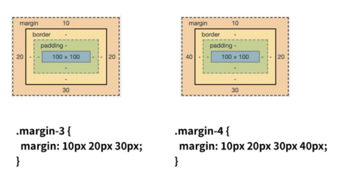
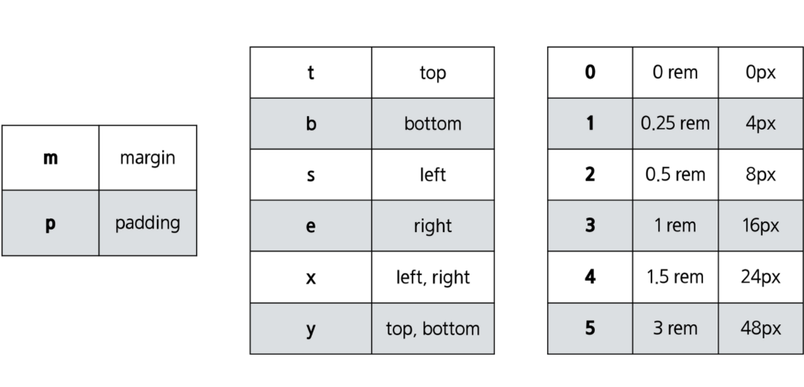

# HTML

- Hyper Text Markup Language

- HTTP(Hyper Text Transfer Protocol

- Markup Language

  - 태그등을 이용하여 문서나 데이터의 구조를 명시하는 언어
  - 프로그래밍 언어와는 다르게 단순하게 데이터를 표현하기만 한다.

- head 요소

  - 문서제목, 문자코드(인코딩) 와 같이 해당 문서 정보를 담고 있으며, 브라우저에 나타나지 않는다.
  - CSS 선언 혹은 외부 로딩 파일 지정 등도 작성한다.

- body 요소

  - 브라우저 화면에 나타나는 정보로 실제 내용에 해당한다.

- DOM 트리

  - Document Object Model
  - 부모관계, 형제관계

  ```html
  <body>
      <h1>웹문서</h1>
      <ul>
          <li>HTML</li>
          <li>CSS</li>
      </ul>
  </body>
  ```

- 시맨틱 태그

  - HTML5에서 의미론적 요소를 담은 태그의 등장.
  - 개발자 및 사용자 뿐만 아니라 검색엔진 등에 의미 있는 정보의 그룹을 태그로 표현
  - 단순히 구역을 나누는 것 뿐만 아니라 '의미'를 가지는 태그들을 활용하기 위한 노력
  - Non semantic 요소는 div,span 등이 있으며 h1,table 태그들도 시맨틱 태그로 볼 수 있음

  - 대표적인 태그
    - header : 문서 전체나 섹션의 헤더(머릿말 부분)
    - nav : 네비게이션
    - aside : 사이드에 위치한 공간, 메인 콘텐츠와 관련성이 적은 콘텐츠
    - section : 문서의 일반적인 구분, 컨텐츠의 그룹을 표8현
    - article : 문서, 페이지, 사이트 안에서 독립적으로 구분되는 영역
    - footer : 문서 전체나 섹션의 푸터(마지막 부분()

- 인라인 요소 / 블럭 요소


# CSS

- Cascading Style Sheets

- 정의방법

  - 인라인

    - 해당 태그에 직접 style 속성을 활용

    ```html
    <h1 style="color: blue; font-size:100px;">
        Hello
    </h1>
    ```

    

  - 내부참조 - <style>

    ```html
    <head>
        <style>
            h1{
                color: blue;
                fonst-size: 100px;
            }
        </style>
    </head>
    ```

    

  - 외부참조(link file) - 분리된 CSS 파일

- 선택자(Selector)

  - 기본 선택자
    - 전체 선택자, 요소 선택자
    - 클래스 선택자, 아이디 선택자, 속성 선택자
  - 결합자 (Combinarors)
    - 자손 결합자
      - 셀렉터A (공백) 셀렉터B
      - 셀렉터A모든 후손 요소중 셀렉터B와 일치하는 요소 선택 
    - 자식 결합자
      - 셀렉터A `>` 셀렉터B
      - 셀렉터A의 모든 자식 요소(level 1) 중 셀렉터B와 일치하는 요소 선택
    - 일반 형제 
      - 셀렉터A `~` 셀렉터B
      - 셀렉터A의 형제 요소 중 셀렉터A 뒤에 위치하는 셀렉터B 요소를 모두 선택
    - 인접 형제 결합자
      - 셀렉터A `+` 셀렉터B
      - 셀렉터A의 형제 요소 중 셀렉터A 바로 뒤에 위치하는 셀렉터B 요소를 선택
      - 단, A와 B 사이에 다른 요소가 존재하면 선택되지 않음

- CSS 적용 우선순위

  - !important
  - 인라인
  - id 선택자
    - `#`문자로 시작하며 기본적으로 클래스선택자와 같은 방식으로 사용
    - 아이디는 문서당 한번만 사용할 수 있으며 요소에는 단일id값만 적용가능
    - 동일한 아이디를 여러번 사용해도 동작은 하나 그러면 안됨.
  - class 선택자
    - 마침표(.) 문자로 시작하며 해당 클래스가 적용된 문서의 모든 항목을 선택
  - 요소 선택자
  - 소스순서

- 상속

  - 상속되는 것
    - Text 관련 요소(font, color, text-align), opacity, visibility
  - 상속되지 않는 것
    - Box model 관련 요소(width, height, margin, padding, border, box-sizing, display)
    - position 관련 요소(position, top/right/bottom/left, z-index)등

- 크기 단위

  - px(픽셀)
    - 모니터 해상도의 한 화소인 '픽셀'을 기준
    - 픽셀의 크기는 변하지 않기 때문에 고정적인 단위
  - %
    - 백분율 단위
    - 가변적인 레이아웃에서 자주 사용
  - em
    - 배수단위, 요소에 지정된 사이즈에 상대적인 사이즈를 가짐
    - em은 상속의 영향 받음, rem은 최상위 요소(html)를 기준으로 결정됨.
    - 상황에 따라 각기 다른 값을 가질 수 있다.
  - rem
    - 최상위 요소(html)의 사이즈(16px)를 기준으로 배수 단위를 가짐.
  - viewport 
    - vx, vh, vmin, vmax
    - (스크롤을 내리지 않은 상태에서) 웹 페이지를 방문한 유저에게 현재 보이는 웹 컨텐츠의 영역
    - viewport를 기준으로한 상대적인 사이즈
    - 주로 스마트폰이나 테블릿 디바이스의 화면을 일컫는 용어로 사용된다.
    - vw, vh

- 색상 단위

  - 색상 키워드

    - 색상 키워드는 대소문자를 구분하지 않는 식별자로, red, blue, black처럼 특정 색을 나타낸다

  - RGB

    - '#' + 16 진수 표기법
    - rgb() 함수형 표기법

    ```css
    p {color: black;}
    p {color: #000; }
    p {color: #000000; }
    p {color: rgb(0,0,0); }
    p {color: rgba(0,0,0,0.5); 
    ```

  - HSL

    - 색상, 채도, 명도

    ```css
    p {color: hsl(120,100%,0); }
    p {color: hsla(120,100%,0.5); }
    ```

- Box Model

  - 구성
    - margin : 테두리 바깥의 외부 여백, 배경색을 지정할 수 없다.
    - border : 테두리 영역
    - padding : 테두리 안쪽의 내부 여백요소에 적용된 배경색, padding까지 적용
    - content : 글이나 이미지 등 요소의 실제 내용

- 

- 
  - border shorthand

    ```css
    .border {
        border-width:2px;
        border-style:dahsed;
        border-color:black;
    }
    .broder {
        border:2px dashed black;
    }
    ```

  - 기본적으로 모든 요소의 `box-sizing` 은 `content-box`

    - padding을 제외한 순수 contents 영역만을 box로 지정

  - 다만, 우리가 일반적으로 영역을 볼때는 bordedr까지의 너비를 100px로 보는 것을 원함

    - 그 경우 `box-sizing`을`border-box`으로 설정

    

  - 마진 상쇄
    
  - 인접 형제 요소간의 margin이 겹쳐서 보임 주로 큰 값을 따름
  
- display

  - 모든 요소는 네모(box model)이고, 어떻게 보여지는지(display) 에 따라 문서에서의 배치가 달라질 수 있다.
  - display : `block`
    - 줄 바꿈이 일어나는 요소
    - 화면 크기 전체의 가로 폭을 차지한다.
    - 블록 레벨 요소 안에 인라인 레벨 요소가 들어갈 수 있음.
  - display : `inline`
    - 줄 바꿈이 일어나지 않는 행의 일부 요소
    - content 너비만큼 가로 폭을 차지한다.
    - width, height, margin-top, margin-bottom을 지정할 수 없다.
    - 상하 여백은 line-heign로 지정한다.
  - 대표적인 블록레벨 요소
    - div / ul, ol, li/ p / hr / form 등
  - 대표적인 인라인 요소
    - span / a / img / input, label / b, em, i, strong ㄷ,ㅇ
  - block
    - 기본은 너비의 100%
  - inline
    - 컨텐츠 영역 만큼만
  - 정렬
    - 왼쪽정렬 : margin-right: auto; / text-align: left;
    - 오른쪽 정렬 : margin-left: auto; / text-align: right;
    - 가운데 정렬 : margin-right: auto; margin-left: auto; / text-align: center;
  - display : `inline-block`
    - block과 inline 레벨 요소의 특징을 모두 갖는다.
    - inline처럼 한 줄에 표시 가능하며,
    - block처럼 width, height, margin 속성을 모두 지정할 수 있다.
  - display : `none`
    - 해당 요소를 화면에 표시하지 않는다. (공간조차 사라진다.)
    - 이와 비슷한 visibility : hidden은 해당요소가 공간은 차지하나 화면에 표시만 하지 않는다.

- position

  - `static` : 디폴트 값(기준 위치)
    - 기본적인 요소에 배치 순서에 따름(좌측 상단()
    - 부모 요소 내에서 배치될 때는 부모 요소의 위치를 기준으로 배치 된다.
  - 아래는 좌표 프로퍼티(top, bottom, left, right)를 사용하여 이동이 가능하다.(음수도가능)
    - `relative` : static 위치를 기준으로 이동(상대 위치)
    - `absolute` : static이 아닌 가장 가까이 있는 부모/조상 요소를 기준으로 이동(절대위치), 부모 요소를 찾아가고 나아가 없다면 body에 붙는다.
    - `fixed` : 부모요소와 관계없이 브라우저를 기준으로 이동(고정 위치)
      - 스크롤시에도 항상 같은 곳에 위치ㅍ
    - **absolute**

      - `absolute`는 원래 위치해 있었던 과거 위치에 있던 공간은 더 이상 존재하지 않는다는 점이 특징이다.
      - 즉, 다른 모든 것과는 별개로 독자적인 곳에 놓이게 된다.
      - 대체 언제 쓸까?
        - 페이지의 다른 요소의 위치와 간섭하지 않는 격리된 사용자 인터페이스 기능을 만들 수 있다.
        - 팝업 정보 상자 및 제어 메뉴, 롤오버 패널, 페이지 어느 곳에서나 끌어서 놓기할 수 있는 유저 인터페이스 페이지 등

- CSS page layout techniques

  - Display

  - Postion

  - Float

    - 한 요소(element)가 정상 흐름(normal flow)으로부터 빠져 텍스트 및 인라인(inline) 요소가 그 주위를 감싸 자기 컨테이너의 좌,우측을 따라 배치되어야 함을 지정한다.
    - Float된 이미지 좌,우측 주변으로 텍스트를 둘러싸는 레이아웃을 위해 도입
    - none : 기본값 
    - left : 요소를 왼쪽으로 띄움
    - right : 요소를 오른쪽으로 띄움

  - Flesbox

    - 요소 간 공간 배분과 정렬 기능을 위한 1차원(단방향) 레이아웃

    - 부모요소에 display : flex;

    - 요소

      - flex container(부모 요소)
      - flex item(자식 요소)

    - 축

      - main axis(메인 축)
      - cross axis(교차축)

    - 배치방향 설정 : flex-direction

      - row, row-reverse, column, column-reverse

    - 메인축 방향 정렬 : justify-content

    - 교차축 방향 정렬 : align-items, align-self, align-content

    - 기타 : flex-wrap, flex-flow, flew-grow, order,...

    - justify & align

      - 

    - content & items & slef

      - content

        - 여러줄

      - items

        - 한줄

      - self

        - flex item 개별요소

      - 예시

        - justify-content : 메인축 기준 여러 줄 정렬
        - align-items : 교차축 기준 한줄 정렬
        - align-self : 교차축 기준 선택한 요소 하나 정렬

      - justify-content

        - flex-start (기본 값)
          - 시작 지점에서 쌓임(왼쪽 → 오른쪽)
        - flex-end
          - 쌓이는 방향이 반대 (`flex-direction: row-reverse` 와는 다르다. 아이템의 순서는 그대로 정렬만 우측에 되는 것.)
        - center
        - space-between
          - 좌우 정렬 (item 들 간격 동일)
        - space-around
          - 균등 좌우 정렬 (내부 요소 여백은 외곽 여백의 2배)
        - space-evenly
          - 균등 정렬 (내부 요소 여백과 외각 여백 모두 동일)

      - align-items

        - stretch (기본 값)
          - 컨테이너를 가득 채움
        - flex-start
          - 위
        - flex-end
          - 아래
        - center
        - baseline
          - item 내부의 text에 기준선을 맞춤

      - align-content

        - flex-start, flex-end, center, stretch, space-between, space-around

      - align-self

        - auto, flex-start, flex-end, center, baseline, stretch

      - **flex-grow**

        - 기본 값 : 0
        - 주축에서 남는 공간을 항목들에게 분배하는 방법
        - 각 아이템의 상대적 비율을 정하는 것이 아님
        - 음수는 불가능

      - **flex-wrap**

        >  item들이 강제로 한 줄에 배치 되게 할 것인지 여부 설정

        - nowrap (기본 값)
          - 모든 아이템들 한 줄에 나타내려고 함 (그래서 자리가 없어도 튀어나옴)
        - wrap : 넘치면 그 다음 줄로
        - wrap-reverse : 넘치면 그 윗줄로 (역순)

      - **flex-flow**

        >  flex-direction 과 flex-wrap 의 shorthand

        ```css
        flex-flow: row nowrap;
        ```

        

  - Grid

- bootstrap

  - CDN(Content Delivery Network)
    - 컨텐츠를 효율적으로 전달하기 위해 여러 노드에 가진 네트워크에 데이터를 제공하는 시스템
    - 개별 end-user의 가까운 서버를 통해 빠르게 전달 가능(지리적 이점)
    - 외부 서버를 활용함으로써 본인 서버의 부하가 적어짐
  - spacing
    - 

  - 

  - color
    - 

  - flex-box
    - 

  - Grid system
    - bootstrap grid system은 flexbox로 제작됨
    - `container`,`rows`,`column`으로 컨텐츠를 배치하고 정렬
    - 반드시 기억해야 할 두가지
      - 12개의 column
      - 6개의 grid breakpoints
    - grid system breakpoints
      - 


